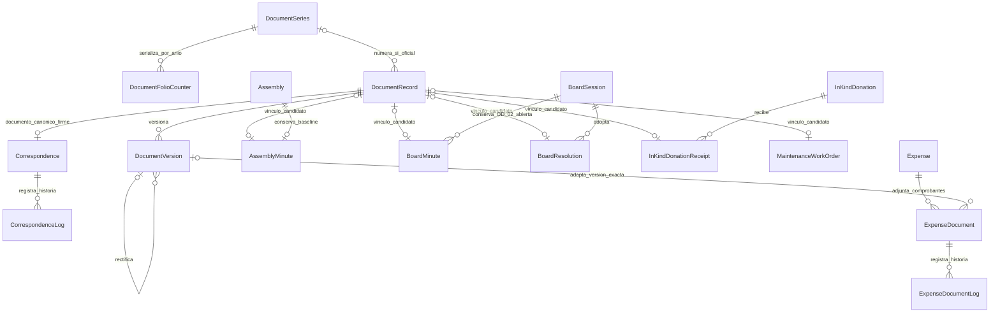

# OD-03 — propuesta de obligaciones documentales tipadas

**Estado:** CANDIDATO V2 para validación institucional; no aprobado, no congelado, no implementado. **Corte:** 2026-10-09.

**Alcance:** consolidar OD-03 sin cambiar ciclos de dominio ni convertir cada trámite en documento oficial. Esta propuesta preserva `DocumentRecord`, `DocumentVersion`, `DocumentSeries`, `DocumentFolioCounter`, `Correspondence`, `CorrespondenceLog`, `ExpenseDocument`, `ExpenseDocumentLog`, `AssemblyMinute`, `BoardMinute` y reglas vigentes de finanzas, donaciones, inventario y mantenimiento.

Fuentes: [9.3D](../../../../docs/architecture/v2/checkpoints/9.3D-documentos.md), [registro de decisiones](../../../../docs/architecture/decisions/decision-register.md), [catálogo lógico](entity-catalog.md), [relaciones](relationship-matrix.md), [restricciones](constraint-matrix.md), [decisiones abiertas](open-decisions.md), [diccionario físico](../physical/data-dictionary.md) y [mapeo Prisma](../physical/prisma-mapping.md).

## 1. Límites confirmados

- `DocumentRecord` identifica y clasifica documento; `DocumentVersion` conserva contenido e historia. Borradores son versionables; documento oficial y evidencia son inmutables y se rectifican sin borrar historia (`DOC-VAL-01`).
- Borrador permanece **sin folio**. Registro oficial asigna atómicamente `seriesId`, `folioYear`, `folioSequence`, `officialRegisteredAt` y estado oficial mediante `DocumentFolioCounter`; versión nunca consume folio.
- Unicidad de folio permanece exactamente `(seriesId, folioYear, folioSequence)`. Folio visible es derivado; no existe string editable ni reutilización de folio comprometido.
- Clasificación permanece `PUBLIC`, `INTERNAL` o `RESTRICTED`, con RBAC contextual (`DOC-VAL-04`). Clasificación `PUBLIC` no prueba obligación de publicación.
- Hecho de dominio conserva titularidad. Documento lo evidencia; no reemplaza aprobación, decisión, recepción, movimiento financiero, movimiento de inventario, reserva, participación ni cierre.
- Vínculos son FK tipadas. No se propone `entityType + entityId`, entidad polimórfica ni nueva entidad especulativa.
- Aprobación de donaciones, firmas legales/digitales, formularios electrónicos de afiliación, referencias documentales de inventario y toda obligación no confirmada permanecen pendientes de validación humana.

## 2. Matriz de decisión por trámite

Leyenda: **Confirmado** = respaldado por contrato vigente; **Candidato** = mínimo estructural propuesto, sujeto a aprobación; **Pendiente** = política institucional no demostrada; **N/A** = no se deriva obligación documental. Clasificaciones posibles: **un documento canónico**, **múltiples adjuntos**, **múltiples documentos registrados independientemente** o **sin clasificación demostrada**. “Adjunto” significa archivo/versionado, no documento oficial independiente.

| Trámite / registro dueño | Patrón documental | Creación | Adjunto | Validación | Registro oficial | Aprobación | Firma | Publicación | Retención |
|---|---|---|---|---|---|---|---|---|---|
| Solicitud de afiliación (`AffiliateRequest`) | Sin obligación demostrada; formulario electrónico pendiente | Confirmada en registro de dominio | Pendiente | Revisión de solicitud existente; validación documental pendiente | Pendiente | Decisión de solicitud existente | Pendiente | N/A | Pendiente |
| Acta de Asamblea (`AssemblyMinute`) | **Un documento canónico** candidato | Acta existente; `DocumentRecord` candidato | `DocumentVersion` 1:N | Pendiente | Pendiente por estado/tipo | Ciclo institucional de acta pendiente (OD-02) | Pendiente | Pendiente | Pendiente |
| Acta de Junta (`BoardMinute`) | **Un documento canónico** candidato | Registro de acta candidato | `DocumentVersion` 1:N | Pendiente | Pendiente por estado/tipo | Ciclo institucional de acta pendiente (OD-02) | Pendiente | Pendiente | Pendiente |
| Acuerdo de Junta (`BoardResolution`) | **Un documento canónico** candidato | Acuerdo estructurado confirmado como hecho distinto | `DocumentVersion` 1:N | Pendiente | Pendiente | Autoridad vive en gobernanza, no en documento | Pendiente | Pendiente | Pendiente |
| Correspondencia (`Correspondence`) | **Un documento canónico** por registro; relación ya firme | `Correspondence.documentRecordId` obligatorio | `DocumentVersion` 1:N | Pendiente por clase | Solo si pasa a oficial; folio atómico | Pendiente por tipo | Pendiente | Pendiente por clasificación | Pendiente |
| Donación monetaria (`Donation`) | Sin documento canónico demostrado | Hecho financiero existente | Pendiente | Confirmación financiera existente; validación documental pendiente | Pendiente | No inferida | Pendiente | N/A | Pendiente |
| Oferta/decisión de donación en especie (`InKindDonation`, `InKindDonationDecision`) | Sin documento canónico demostrado | Hechos separados confirmados | Pendiente | Identidad y competencia según ciclo confirmado | Pendiente | **Pendiente de validación humana**; no alterar `InKindDonationDecision` | Pendiente | N/A | Pendiente |
| Recepción de donación en especie (`InKindDonationReceipt`) | **Un documento canónico** candidato por recepción parcial/total | Recepción separada confirmada | `DocumentVersion` 1:N | Detalle físico confirmado; validación documental pendiente | Pendiente | No sustituye decisión de donación | Pendiente | N/A | Pendiente |
| Reserva (`Reservation`) | Sin obligación demostrada | Registro de dominio existente | Pendiente | Aprobación operativa existente; documento no exigido | Pendiente | No añadir aprobación documental | Pendiente | N/A | Pendiente |
| Voluntariado (`VolunteerApplication`, `VolunteerParticipation`, `VolunteerAttendance`) | Sin obligación demostrada | Registros de dominio existentes | Pendiente | Ciclos existentes; documento no exigido | Pendiente | No añadir aprobación documental | Pendiente | N/A | Pendiente |
| Comprobantes de gasto (`ExpenseDocument`) | **Múltiples adjuntos** por `Expense`; no son por defecto documentos registrados independientemente | Entidad especializada existente | 1:N desde `Expense`; adaptación opcional a versión exacta | Log append-only propuesto | Pendiente por comprobante | No sustituye autorización financiera | Pendiente | N/A | Pendiente |
| Cierre de mantenimiento (`MaintenanceWorkOrder`) | **Un documento canónico** candidato de cierre + evidencia digital proporcional | Orden existente; documento candidato | `DocumentVersion` 1:N; `verificationEvidence` preservada | Aptitud antes de cierre confirmada; contenido/verificador por riesgo pendiente (OD-06) | Pendiente | Autorización operativa y financiera siguen separadas | Pendiente | N/A | Pendiente |
| Inventario/procedencia (`InventoryItem`, lote, unidad, movimientos) | Sin documento canónico demostrado | Hechos y procedencia tipada existentes | Referencias documentales pendientes | Integridad física existente | Pendiente | N/A | Pendiente | N/A | Pendiente |

Ninguna fila “Pendiente” se convierte en requisito, estado, actor, plazo o constraint por defecto. Casos sin obligación demostrada no reciben FK en esta propuesta. Ningún trámite se clasifica hoy como **múltiples documentos registrados independientemente**: evidencia disponible no demuestra esa política; una rectificación oficial sigue siendo otro `DocumentRecord` por regla transversal, no multiplicidad ordinaria del trámite.

## 3. Delta estructural mínimo propuesto

**Paquete de forma canónica sometido a aprobación atómica:** **1 campo + 1 FK + 5 UQ**. Campo y FK son forma nueva para `AssemblyMinute`; cinco UQ también son cambio estructural: cuatro pasan de condicionadas OD-03 a firmes y una es nueva. Paquete completo se aprueba o rechaza como unidad; no admite aceptar campo/FK mientras se rechaza arbitrariamente alguna UQ.

### 3.1 Relaciones tipadas preservadas

| Propietario.campo | Destino | Nulabilidad / cardinalidad | Clave | Tratamiento |
|---|---|---|---|---|
| `Correspondence.documentRecordId` | `DocumentRecord.id` | NOT NULL; cada correspondencia tiene 1 documento | UQ existente | Preservar firme |
| `BoardMinute.documentRecordId?` | `DocumentRecord.id` | nullable; acta 0..1 documento mientras borrador/historia no se concilie | UQ candidata | Preservar y someter obligatoriedad a matriz aprobada |
| `BoardResolution.documentRecordId?` | `DocumentRecord.id` | nullable; acuerdo 0..1 documento | UQ candidata | Preservar y someter obligatoriedad a matriz aprobada |
| `InKindDonationReceipt.documentRecordId?` | `DocumentRecord.id` | nullable; recepción 0..1 documento | UQ candidata | Preservar; no fusionar oferta, decisión y recepción |
| `MaintenanceWorkOrder.documentRecordId?` | `DocumentRecord.id` | nullable; orden 0..1 documento canónico | UQ candidata | Preservar evidencia digital y gate de cierre |
| `ExpenseDocument.documentVersionId?` | `DocumentVersion.id` | nullable; versión 0..N comprobantes durante adaptación | sin UQ | Preservar `ExpenseDocument`/log y `DOC-HIST-01` |

### 3.2 Delta de forma — asociación faltante (1 campo + 1 FK)

Agregar al candidato lógico/físico futuro, después de aprobación:

- Campo `AssemblyMinute.documentRecordId?`.
- FK candidata `fk_assembly_minute_document`: `AssemblyMinute.documentRecordId? → DocumentRecord.id`, `ON DELETE RESTRICT`, `ON UPDATE CASCADE`.
- Cardinalidad: `AssemblyMinute 0..1 → 1 DocumentRecord`; UQ nullable en `AssemblyMinute.documentRecordId` para impedir reutilización dentro de actas de Asamblea.
- Nulabilidad inicial preserva actas históricas y borradores. Hacerla obligatoria por estado requiere matriz institucional aprobada y cierre de `DOC-HIST-01`; no fabricar vínculos en backfill.
- `AssemblyMinute.assemblyId` y su UQ baseline permanecen sin cambio. Esta propuesta no resuelve OD-02 ni redefine identidad/ciclo del acta.

No se agregan relaciones a afiliación, donación monetaria, reserva, voluntariado o inventario: evidencia disponible no demuestra obligación documental. Tampoco se agregan entidades de adjuntos; `DocumentVersion` cubre contenido versionado y `ExpenseDocument` conserva comprobantes especializados.

### 3.3 Delta de constraints — cinco UQ nominales

| UQ sometida a aprobación | Estado previo | Efecto local |
|---|---|---|
| `uq_assembly_minute_document` sobre `AssemblyMinute.documentRecordId` | Nueva | Un `DocumentRecord` aparece como máximo en una fila `AssemblyMinute` |
| `uq_board_minute_document` sobre `BoardMinute.documentRecordId` | Condicionada OD-03 (`VU31`) | Máximo una fila `BoardMinute` por documento |
| `uq_board_resolution_document` sobre `BoardResolution.documentRecordId` | Condicionada OD-03 (`VU32`) | Máximo una fila `BoardResolution` por documento |
| `uq_inkind_receipt_document` sobre `InKindDonationReceipt.documentRecordId` | Condicionada OD-03 (`VU33`) | Máximo una recepción por documento |
| `uq_work_order_document` sobre `MaintenanceWorkOrder.documentRecordId` | Condicionada OD-03 (`VU34`) | Máximo una orden por documento |

Estas UQ son locales. Junto con `uq_correspondence_document` existente, **no impiden** que el mismo `DocumentRecord.id` aparezca una vez en varias tablas propietarias. Exclusividad transversal es decisión separada, no consecuencia de estas cinco UQ.

Las cinco UQ integran paquete atómico de forma canónica. Sin ellas, opción B permitiría además reutilización múltiple dentro del mismo tipo de dueño y dejaría de representar “un documento canónico”; opción A tampoco tendría las seis defensas locales que su enforcement presupone. Por tanto no existe H3 de aceptación parcial en paquete completo.

### 3.4 Decisión explícita de ownership/reutilización transversal

**Frontera de evidencia:** fuentes confirman FK tipadas, titularidad de hechos de dominio, identidad/versionado documental e inmutabilidad oficial. No confirman si un `DocumentRecord` canónico puede respaldar simultáneamente registros de dominios distintos. “Canónico” en la matriz limita cada fila propietaria a 0..1 documento; no prueba dueño transversal exclusivo.

| Opción humana | Semántica | Enforcement mínimo | Impacto estructural/contable |
|---|---|---|---|
| **A. Dueño canónico exclusivo** — recomendación arquitectónica, pendiente de aprobación | Un `DocumentRecord` puede ser canónico de como máximo una fila entre `Correspondence`, `AssemblyMinute`, `BoardMinute`, `BoardResolution`, `InKindDonationReceipt` y `MaintenanceWorkOrder` | Conservar seis UQ locales y agregar invariante PostgreSQL intertabla que bloquee la fila `DocumentRecord.id` antes de comprobar las seis tablas, más validación transaccional con el mismo lock; servicio solo no basta. Sin FK polimórfica ni entidad nueva. | Totales principales quedan 82/889/159/73/166; PostgreSQL-only **24+1=25** y TX **34+1=35** |
| **B. Reutilización transversal permitida** | Mismo documento puede evidenciar varios registros de dominio | Cinco UQ propuestas + UQ de correspondencia solo controlan duplicación dentro de cada tabla. Deben aprobarse autoridad para registrar/rectificar/anular, clasificación, retención y resolución de conflictos entre dueños. | Totales principales 82/889/159/73/166; PostgreSQL-only **24**, TX **34** |
| **C. Reutilización selectiva por pares** — bloqueada | Solo combinaciones institucionales expresamente aprobadas pueden compartir documento | Requeriría lista cerrada de pares + mismo lock por `DocumentRecord.id` + invariante PostgreSQL intertabla y validación transaccional. Ningún par está demostrado hoy. | No es opción aprobable en este paquete; exige evidencia, rediseño y reconteo propios |

**Recomendación mínima A, no decisión institucional:** ownership exclusivo evita que dominios distintos compitan por estado oficial, rectificación, anulación, clasificación y retención de una misma identidad documental; además preserva FK tipadas sin crear entidad especulativa. Recomendación solo se vuelve contrato si autoridad humana marca A. B requiere aprobar semántica compartida indicada antes de 1B. C permanece bloqueada hasta identificar pares con evidencia. No generar trigger, asociación ni constraint transversal antes de respuesta.

## 4. Conteos actuales y propuestos

Universo: objetivo firme sin `BoardSessionAttendance` (OD-01) ni `IdentityReconciliationManifest` transicional. “Actual” significa candidato documental 9.4C-C con OD abiertas, no esquema implementado.

| Medida | Actual documentado | Delta OD-03 propuesto | Total si se aprueba | Aritmética |
|---|---:|---:|---:|---|
| Modelos/tablas objetivo | 82 | 0 | **82** | no entidad nueva |
| Campos/columnas objetivo | 888 | +1 | **889** | `AssemblyMinute.documentRecordId?` |
| FK | 158 | +1 | **159** | asociación tipada faltante |
| CK/UQ firmes | 68 | +5 | **73** | activar 4 UQ OD-03 existentes + 1 UQ nueva |
| Índices explícitos aceptados | 166 | 0 | **166** | UQ crea índice implícito; no duplicar índice FK |

Delta completo: campo `AssemblyMinute.documentRecordId?`; FK `fk_assembly_minute_document`; UQ `uq_assembly_minute_document`, `uq_board_minute_document`, `uq_board_resolution_document`, `uq_inkind_receipt_document` y `uq_work_order_document`. Conteos de PK, CHECK y EXCLUDE no cambian. Conteos físicos/Prisma vigentes no deben reescribirse hasta aprobación humana.

Ownership produce variante de enforcement, no de modelos/campos/FK/UQ/índices. Todos los escenarios siguientes excluyen `BoardSessionAttendance` y sus objetos condicionales de OD-01, cualquier UQ/índice/objeto condicional de OD-02 y demás ODs abiertas; incluyen solo universo firme 9.4C-C más paquete OD-03 completo cuando corresponde. Por eso `68+5=73` significa **68 CK/UQ firmes fuera de OD-01/OD-02 y otras condicionales + cinco UQ del paquete OD-03**, no conteo global de todos los candidatos documentales. Escenarios coherentes:

| Escenario | Modelos | Campos | FK | CK/UQ | Índices explícitos | PostgreSQL-only | TX | Resultado |
|---|---:|---:|---:|---:|---:|---:|---:|---|
| Paquete rechazado | 82 | 888 | 158 | 68 | 166 | 24 | 34 | Conserva candidato actual con OD-03 abierta |
| Paquete completo + H1-B | 82 | 889 | 159 | 73 | 166 | 24 | 34 | Reutilización entre dominios permitida; máximo una fila por tipo dueño |
| Paquete completo + H1-A | 82 | 889 | 159 | 73 | 166 | 25 | 35 | Dueño canónico exclusivo; escenario recomendado |
| H1-C o algún H4 “no aplica” | — | — | — | — | — | — | — | Paquete incompatible: rediseñar y recontar antes de 1B |

Cinco UQ crean cinco índices únicos B-tree implícitos; por eso CK/UQ sube `68+5=73` dentro del alcance firme indicado —sin OD-01, OD-02 ni otras condicionales—, pero índices **explícitos** permanecen **166** dentro del mismo alcance. No agregar índices FK duplicados. Opción A usa esas cinco UQ más `uq_correspondence_document`; opción B también conserva las seis UQ locales para impedir reutilización dentro de cada tipo dueño.

## 5. ER documental propuesto

Diagrama expresa FK tipadas y nulabilidad candidata, no obligatoriedad institucional por estado. Varias relaciones desde `DocumentRecord` muestran que UQ locales permiten reutilización entre tablas; diagrama no selecciona opción A/B/C. Mermaid no expresa gate `DOC-HIST-01`, atomicidad de folio, ownership intertabla ni constraints condicionales.

## 6. Preguntas restantes para aprobación humana

1. **Ownership obligatorio:** elegir A —dueño exclusivo— o B —reutilización entre dominios permitida— de §3.4. Si B, definir autoridad, rectificación/anulación, clasificación, retención y resolución de conflictos. C no puede elegirse sin pares respaldados por evidencia y nuevo diseño.
2. Para `AssemblyMinute`, `BoardMinute`, `BoardResolution`, `InKindDonationReceipt` y `MaintenanceWorkOrder`, ¿en qué estado exacto el documento canónico pasa de opcional a obligatorio, si alguno?
3. ¿Cada acta de Asamblea/Junta tiene una identidad institucional única o varias? OD-02 sigue abierta; versionado no responde esa política.
4. ¿Aprobación de donación en especie genera documento oficial separado, queda solo en decisión estructurada o se incorpora a otro documento? No imponer por defecto.
5. ¿Formularios electrónicos de afiliación son documentos operativos, adjuntos o solo snapshots del registro? ¿Requieren firma?
6. ¿Qué firma o validación legal aplica por clase, quién la realiza y qué metadatos deben conservarse? OD-04 sigue abierta.
7. ¿Qué clases se publican y por qué canal? `PUBLIC` controla acceso; no prueba mandato de publicación.
8. ¿Qué plazo/evento de retención y eliminación aplica por clase? Documentos oficiales/evidencia ya son inmutables, pero plazo no está aprobado.
9. ¿Comprobantes de gasto, donaciones monetarias, reservas o voluntariado requieren documento oficial o solo adjuntos? Evidencia actual no lo confirma.
10. ¿Inventario requiere referencias documentales adicionales a procedencia tipada, movimientos y recepción física? No crear referencias sin respuesta.
11. ¿Qué niveles de riesgo, evidencia mínima y verificador competente aplican al cierre de mantenimiento (OD-06)?

### Paquete nominal de aprobación

Autoridad humana debe responder en orden; silencio no aprueba defaults:

1. **H1 ownership — marcar una:** `[ ] A. exclusivo (recomendado)` / `[ ] B. compartido entre dominios`. C queda bloqueada.
2. **H2 forma canónica — marcar una:** `[ ] aprobar paquete atómico completo` / `[ ] rechazar paquete completo`.

H2 aprobado incluye exactamente: `AssemblyMinute.documentRecordId?`; `fk_assembly_minute_document`; `uq_assembly_minute_document`; `uq_board_minute_document`; `uq_board_resolution_document`; `uq_inkind_receipt_document`; `uq_work_order_document`. No hay votación H3 separada ni aceptación arbitraria de UQ.

3. **H4 obligatoriedad — completar cada fila solo si H2 se aprueba:**

| Dueño canónico propuesto | Marcar una respuesta |
|---|---|
| `AssemblyMinute` | `[ ] opcional siempre` / `[ ] obligatorio desde estado aprobado: ____` / `[ ] no aplica` |
| `BoardMinute` | `[ ] opcional siempre` / `[ ] obligatorio desde estado aprobado: ____` / `[ ] no aplica` |
| `BoardResolution` | `[ ] opcional siempre` / `[ ] obligatorio desde estado aprobado: ____` / `[ ] no aplica` |
| `InKindDonationReceipt` | `[ ] opcional siempre` / `[ ] obligatorio desde estado aprobado: ____` / `[ ] no aplica` |
| `MaintenanceWorkOrder` | `[ ] opcional siempre` / `[ ] obligatorio desde estado aprobado: ____` / `[ ] no aplica` |

“Opcional siempre” conserva FK nullable. “Obligatorio desde estado aprobado” conserva columna nullable físicamente para borrador/historia y exige transición mediante CHECK/trigger/TX según vocabulario aprobado; no implica `NOT NULL` global. “No aplica” rechaza ese dueño canónico, saca su vínculo/UQ del paquete y **obliga rediseño y reconteo antes de 1B**; no se interpreta como resta mecánica ni aprobación parcial.

4. **H5 dependencias — confirmar tratamiento:** OD-02 para identidad/ciclo de actas; OD-04 para firma/retención; OD-06 para evidencia de mantenimiento; `DOC-HIST-01` para historia. Ninguna respuesta se infiere.

Resultado completo requiere H1 A/B, H2 aprobado, cinco respuestas H4 distintas de “no aplica” y tratamiento H5. H2 rechazado conserva escenario actual. Cualquier “no aplica” o solicitud de UQ parcial devuelve paquete a rediseño; no habilita 1B.

## 7. Gate Prisma Checkpoint 1B

**GO para presentar paquete atómico a decisión humana. NO-GO para Prisma Checkpoint 1B.**

**Bloquean cierre de diseño/schema-only para 1B:** H1 A/B; aprobación atómica H2; cinco respuestas H4 sin “no aplica”; estados/vocabulario explícitamente aprobados donde H4 elija obligatoriedad; impacto OD-02 sobre actas; contrato de enforcement intertabla si H1-A. `DOC-HIST-01` permanece declarado como gate documental no resuelto: diseño/schema-only puede llevar enlaces FK nullable provisionales y registrar explícitamente ese gate, sin afirmar historia conciliada ni autorizar obligatoriedad.

OD-04 bloquea campos/reglas de firma y retención, no estas FK/UQ si permanecen fuera del paquete. OD-06 bloquea vocabulario/contenido de evidencia de mantenimiento, no vínculo canónico nullable; sí bloquea cualquier H4 que dependa de estado de cierre aún no aprobado.

**Bloquean enforcement físico, backfill, migración/DDL y validación histórica:** `DOC-HIST-01` con inventario y mapping histórico; hashes/metadatos y excepciones; preflight de duplicados para cinco UQ; backfill verificable; `NOT VALID`/`VALIDATE` para FK aplicable; creación concurrente y attach de UQ; transición condicionada antes de obligatoriedad; prueba de lock/invariante si H1-A; rollback/forward-fix y autorización explícita de migración. Hasta cerrar estos gates: no ejecutar DDL ni editar migraciones, y no declarar datos conciliados. No editar `schema.prisma`, diseño físico vigente, conteos Prisma, código ni datos; no congelar.
