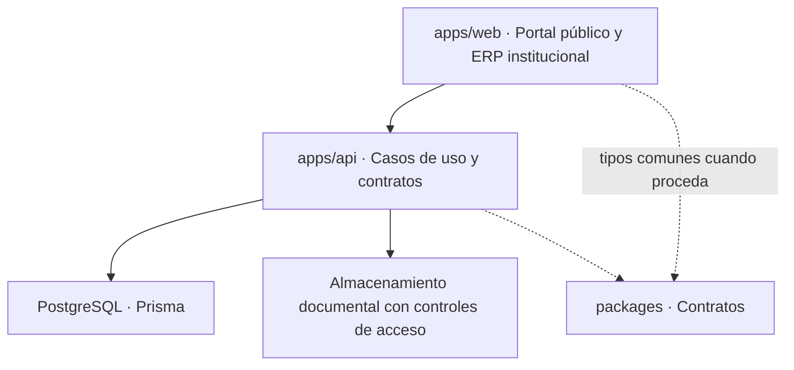

# Arquitectura

## Decisiones y trazabilidad

- [ADR-0001: Monorepo modular](decisions/ADR-0001-monorepo-modular.md)
- [Registro de decisiones V2](decisions/decision-register.md)
- [Atlas de diagramas por checkpoint](v2/README.md)

## Modelo de alto nivel

Diagrama de arquitectura **objetivo**, no infraestructura implementada. Monolito modular previsto; no crear microservicios salvo decisión futura.
