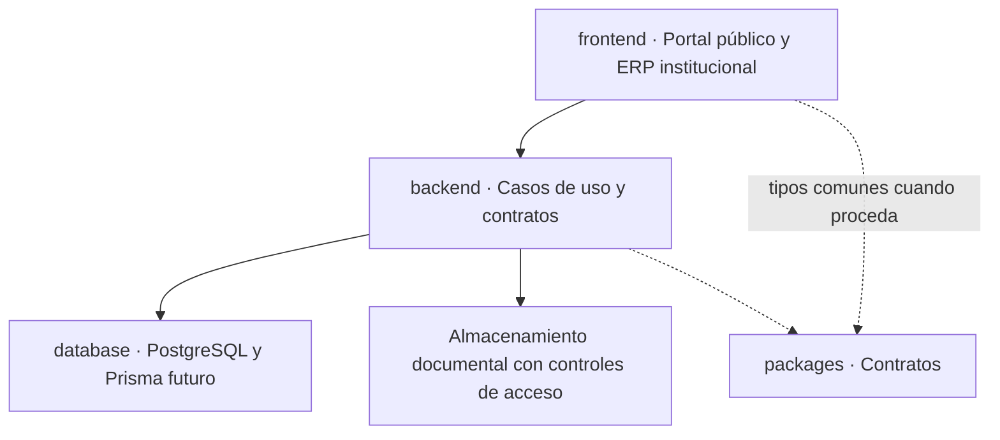

# Arquitectura

## Decisiones y trazabilidad

- [ADR-0001: Monorepo modular](decisions/ADR-0001-monorepo-modular.md)
- [Registro de decisiones V2](decisions/decision-register.md)
- [Atlas de diagramas por checkpoint](v2/README.md)

## Modelo de alto nivel

**D-ADR-0001-01 — Monorepo modular de alto nivel**

**Tipo:** flujo. **Estado:** objetivo aceptado; implementación parcial. **Decisión:** [ADR-0001](decisions/ADR-0001-monorepo-modular.md). **Procedencia:** diagrama objetivo propio de este repositorio V2; no reconstruye arquitectura desplegada de V1.1.

Diagrama de arquitectura **objetivo**, no infraestructura implementada. Monolito modular previsto; no crear microservicios salvo decisión futura.
