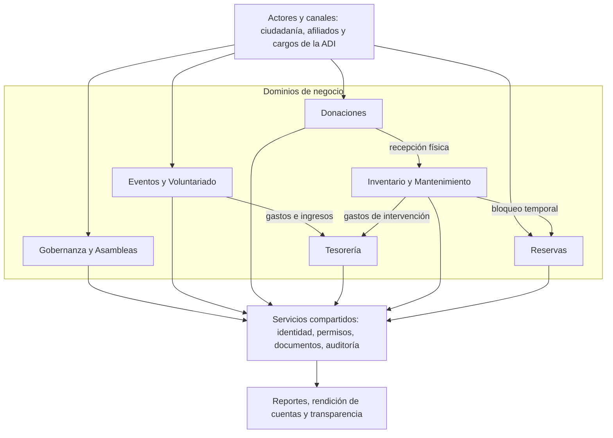

# SGI-Curime V2 — Atlas de diagramas y trazabilidad de checkpoints

> **Estado:** borrador documental para revisión. No constituye DDL, esquema Prisma ni aprobación de migraciones.
> **Corte de trabajo:** 2026-10-08.
> **Propósito:** preservar las decisiones funcionales confirmadas y las propuestas gráficas de los checkpoints 9.2A–9.3D.

## Dos niveles distintos de documentación

1. **Documentación técnica del proyecto:** este atlas, con diagramas, fichas de decisión, relaciones y pendientes. No representa archivos institucionales generados por el SGI.
2. **Capacidad documental del ERP:** diseño pendiente para almacenar actas, recibos, comprobantes, documentos técnicos y evidencias con sus permisos, folios, versiones y asociaciones tipadas.

## Índice

- [9.2A — Gobernanza](checkpoints/9.2A-gobernanza.md)
- [9.2B — Eventos](checkpoints/9.2B-eventos.md)
- [9.2C — Donaciones](checkpoints/9.2C-donaciones.md)
- [9.2D — Inventario, instalaciones y mantenimiento](checkpoints/9.2D-mantenimiento.md)
- [9.3A — Egresos y autorizaciones](checkpoints/9.3A-finanzas.md)
- [9.3B — Iniciativas y destinos](checkpoints/9.3B-iniciativas.md)
- [9.3C — Préstamos, faltantes y donaciones](checkpoints/9.3C-conciliacion.md)
- [9.3D — Documentos del ERP (propuesta)](checkpoints/9.3D-documentos.md)
- [Matriz de diagramas y decisiones](matriz-diagramas.md)
- [Convenciones](convenciones.md)
- [Pendientes y contradicciones](pendientes.md)

## Arquitectura funcional transversal

Este mapa describe **responsabilidades**, no dependencias de clases ni contratos de implementación. El atlas no sustituye el modelo relacional V1.1.

## Calidad, procedencia y uso

- Las decisiones de los checkpoints 9.2D y 9.3A–9.3C se han reconstruido a partir de su descripción y diagramas presentes en la conversación.
- Las vistas 9.2A–9.2C se **redibujaron** a partir de decisiones conocidas: no se presentan como exportaciones idénticas de fuentes gráficas anteriores.
- Los diagramas se mantienen en bloques Mermaid editables. Las salidas SVG/HTML/PNG se podrán generar posteriormente con el procedimiento real del repositorio y su skill `diagram-design`, previa verificación de la estructura existente.
- Toda regla pendiente está expresamente marcada. No inferir una restricción FK definitiva a partir de una flecha de flujo.
- Los identificadores y nombres son **candidatos conceptuales** cuando no existen en el target V1.1.
- Antes de incorporar al repositorio: comparar con `AGENTS.md`, `DESIGN.md`, atlas previo, modelo V1.1 y OpenSpec si aplica.

## Línea base verificada

- Target V1.1: 49 entidades persistentes + 1 entidad transicional, 77 relaciones maestras, sujeto a gates de reconciliación.
- `Person` representa identidad física, `User` acceso y `Affiliate` afiliación; son conceptos diferentes.
- `InventoryItem.currentQuantity` significa **cantidad disponible**, no existencia física total.
- `Donation` V1.1 es monetaria; las recepciones en especie no deben crear ingresos monetarios ficticios.

Referencias de lectura:
- [Target Data Model V1.1](https://github.com/matiasfarrierzuniga-rgb/SGI-Curime/blob/main/docs/data/v1.1/target-model.md)
- [Reglas de integridad V1.1](https://github.com/matiasfarrierzuniga-rgb/SGI-Curime/blob/main/docs/data/v1.1/integrity-rules.md)
- [Prisma schema](https://github.com/matiasfarrierzuniga-rgb/SGI-Curime/blob/main/backend/prisma/schema.prisma)

**No se ha escrito en GitHub ni se han modificado archivos de producción.**
