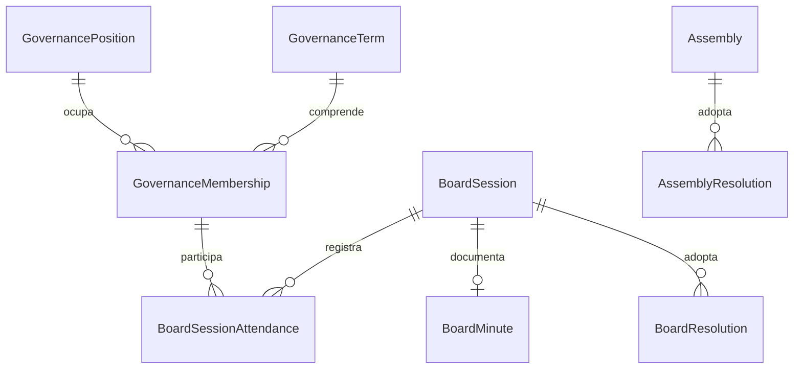
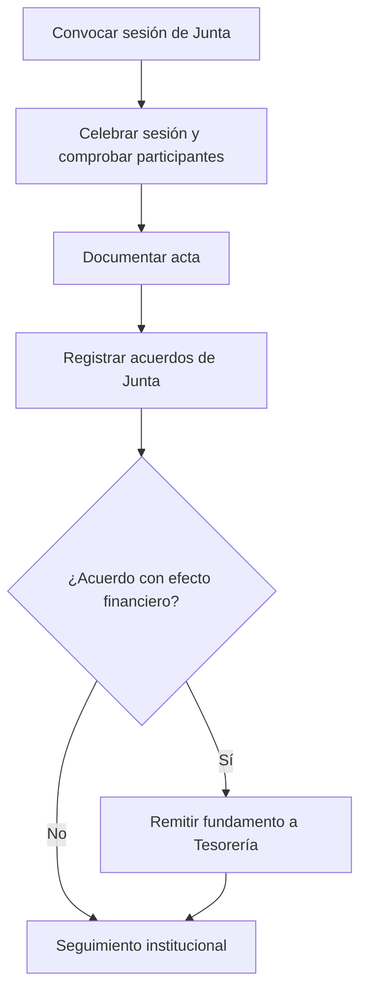

# 9.2A — Gobernanza: sesiones, actas y acuerdos

**Estado:** submodelo funcional trabajado; diagramas **redibujados** para el atlas, no transcripciones idénticas de gráficos anteriores.
**Decisiones:** diferenciar Junta Directiva, Asamblea, cargo institucional y cuenta `User`.
**Candidatas:** `BoardSession`, `BoardMinute`, `BoardResolution`, `BoardSessionAttendance` (condicionada).

## D-9.2A-01 — Relaciones de gobierno (ER conceptual)

`BoardSessionAttendance` sigue condicionada a si requiere registro individual estructurado; no se debe declararla física. `BoardMinute` puede ser 0..1 por sesión según el ciclo de documentación aún por precisar.

## D-9.2A-02 — Flujo institucional (candidato)

**Invariantes:** `BoardResolution` no es `AssemblyResolution`; pertenecer a Junta no otorga por sí mismo permisos RBAC; los acuerdos no son desembolsos; el acta y sus versiones documentales se vincularán sin duplicar decisiones.

**Pendiente:** autorización de gasto ordinario frente a acuerdos específicos, control de designaciones vigentes y reglas documentales de actas; evitar atribuir a una Asamblea acuerdos propios de Junta.
