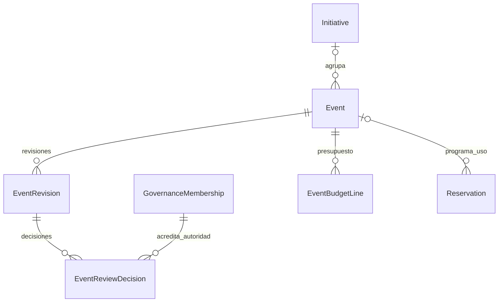
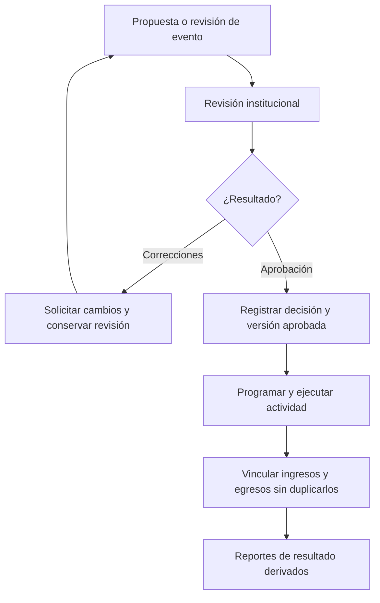

# 9.2B — Eventos: revisiones, aprobación y ejecución económica

**Estado:** decisiones funcionales conocidas; diagramas redibujados.
**Entidades:** V1.1 `Event`, `Reservation`, `FinancialMovement`; V2 candidatas `EventRevision`, `EventReviewDecision`, `EventBudgetLine`.

## D-9.2B-01 — Relaciones conceptuales

`Initiative` fue propuesta posteriormente en 9.3B y se incluye aquí como vínculo transversal actualizado. Las decisiones presidenciales se acreditan mediante nombramiento vigente y capacidad de acceso; no asumir que `User` con rol genérico basta.

## D-9.2B-02 — Revisión de evento

**Invariantes:** revisión ≠ decisión; presupuesto estimado ≠ movimiento contable; no almacenar utilidad duplicada; `EventFinancialAllocation` de fraccionamiento entre destinos se retiró para V2 en FIN-VAL-02.

**Pendiente:** reglas de cambios a eventos ya aprobados, presupuesto definitivo y atribución financiera al destino único.
