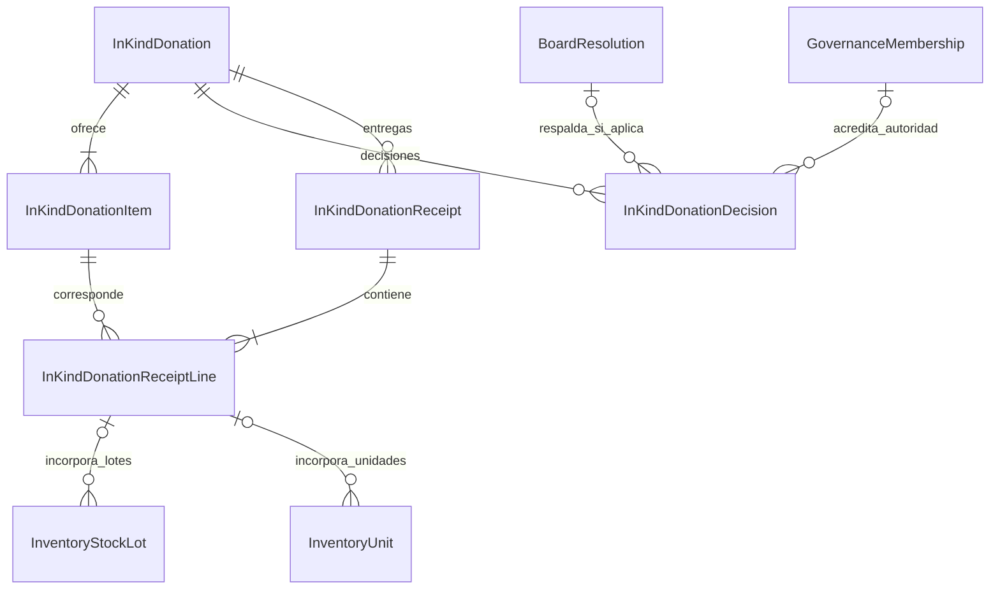
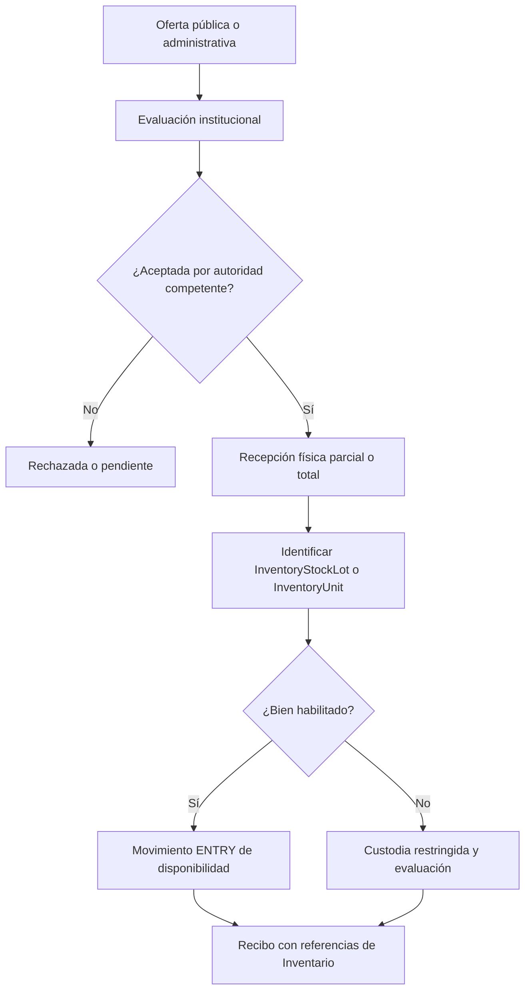

# 9.2C — Donaciones en especie

**Estado:** decisiones funcionales confirmadas; gráficos redibujados desde sus reglas, sin suplantar los originales.
**Decisiones:** DON-VAL-04/05/06/07/08 y DON-INV-VAL-01. Distribución especializada a beneficiarios diferida V3.

## D-9.2C-01 — Oferta, decisión y recepción (ER)

Las relaciones hacia lotes y unidades representan procedencia rastreable; no constituyen flujo de caja. La documentación de ingreso físico debe identificar los bienes recibidos por unidad o lote.

## D-9.2C-02 — Flujo de donación en especie

**Invariantes:** oferta ≠ recepción; aceptación urgente de Presidencia requiere competencia previa válida e información posterior a Junta; bienes de beneficiarios entran primero al Inventario; nunca inventar `FinancialMovement` INCOME por donación en especie. El posible reconocimiento patrimonial no equivale a ingreso monetario.

**Pendiente:** requisitos de comprobante por nivel, firmantes, valoraciones patrimoniales y reconciliación histórica.
