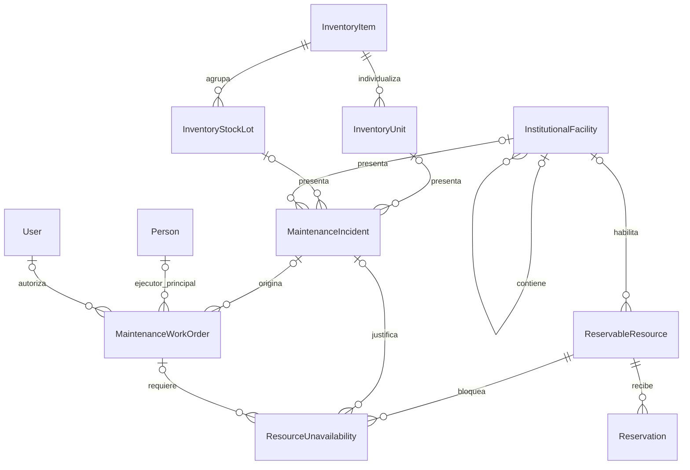
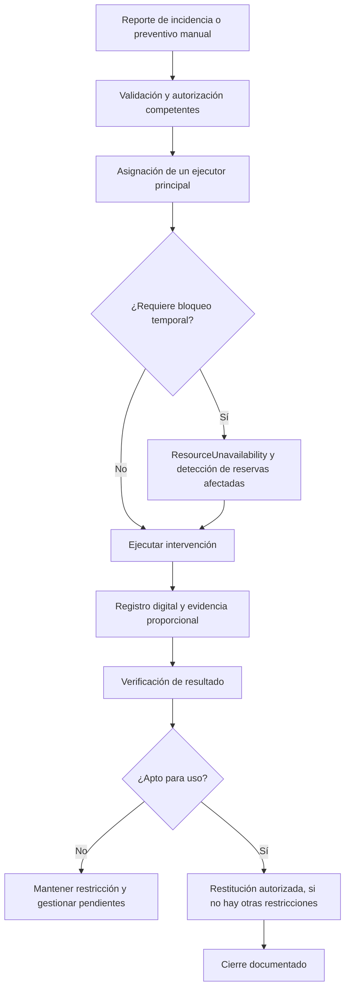

# 9.2D — Inventario, instalaciones, incidencias y mantenimiento

**Estado:** INV-VAL-01/02/03 y MNT-VAL-01/02/03/04/05 confirmadas funcionalmente.
**Candidatas:** `InstitutionalFacility`, `InventoryStockLot`, `InventoryUnit`, `MaintenanceIncident`, `MaintenanceWorkOrder`, `ResourceUnavailability`.

## D-9.2D-01 — Entidades y relaciones

**Exclusividad:** cada orden tiene exactamente un objeto físico principal al autorizarse; puede no tener incidencia si es preventiva. La identidad del ejecutor principal es obligatoria al asignar, aunque no tenga `User`.

## D-9.2D-02 — Mantenimiento, verificación y disponibilidad

**Invariantes:** los reportes públicos no autorizan reparaciones; una restricción de seguridad puede preceder a la orden; los bloqueos no cancelan reservas aprobadas automáticamente; autorización operativa no es autorización financiera; cumplimiento de fecha programada no prueba aptitud.

**Pendiente:** formalización de designaciones, nivel documental por riesgo, tratamiento de intervalos de seguridad y enlaces de gasto.
