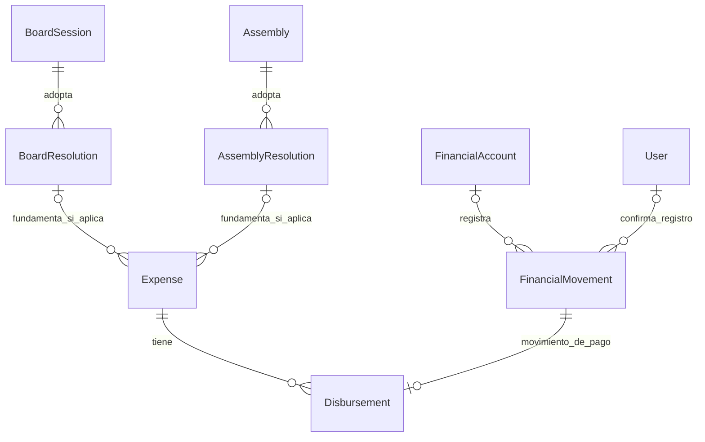
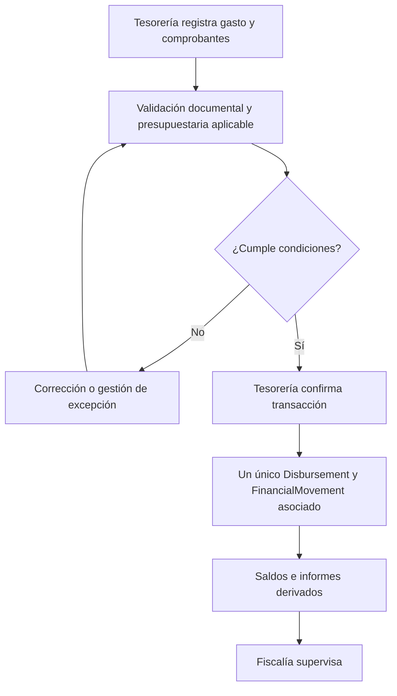

# 9.3A — Egresos ordinarios y autorizaciones institucionales

**Estado:** FIN-VAL-01 aclarado. Tesorería registra y confirma egresos ordinarios sin aprobación individual obligatoria de Presidencia. Revisión presidencial previa descrita corresponde al flujo de Donaciones, no al egreso ordinario.

## D-9.3A-01 — Acuerdos y ejecución financiera

La cardinalidad se lee así: cada `Disbursement` referencia exactamente un `FinancialMovement`; un `FinancialMovement` puede existir sin `Disbursement` y admite como máximo uno. La unicidad de `Disbursement.movementId` impide asociar dos desembolsos al mismo movimiento. Las referencias a acuerdo son condicionales y no simultáneas por defecto.

## D-9.3A-02 — Egreso ordinario

**Invariantes:** registrar no equivale a autorizar; Presidente no firma cada egreso ordinario por defecto; Fiscalía supervisa; gasto aprobado no es dinero desembolsado; cambios a movimientos monetarios registrados siguen anulaciones/reversiones controladas.

**Pendiente:** límites de caja chica y presupuesto, acuerdos extraordinarios y significado definitivo de `Expense.status`.
