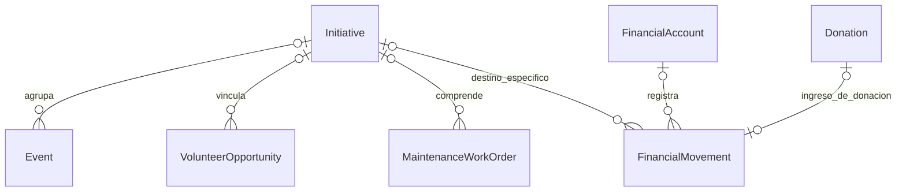
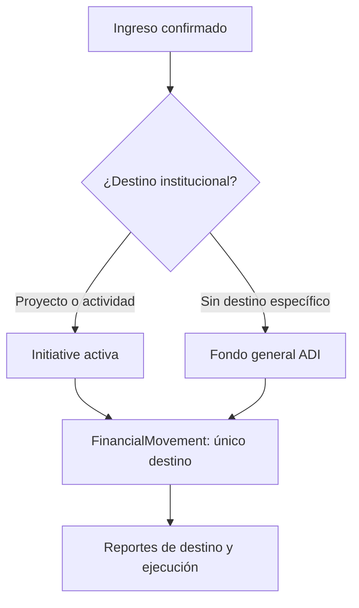

# 9.3B — Iniciativas y destinos financieros

**Estado:** FIN-VAL-02/03 confirmadas funcionalmente. Un movimiento de ingreso confirmado tiene un solo destino: iniciativa activa o fondo general. Sin fraccionamiento a múltiples eventos en V2.

## D-9.3B-01 — `Initiative` como contenedor comunitario

`Initiative` comprende obras, eventos o actividades sin duplicar `Event` ni `VolunteerOpportunity`. Fondo general no se modela como iniciativa ficticia.

## D-9.3B-02 — Asignación directa a un destino

**Invariantes:** destino ≠ cuenta financiera; destino inicial ≠ ejecución posterior; el mismo movimiento no se divide en V2; `FundingAllocation` V1.1 permanece como mecanismo de financiación de gastos y no debe eliminarse.

**Pendiente:** clasificación y estados de iniciativas, reglas de cambio de destino y alcance operativo de `Initiative`.
