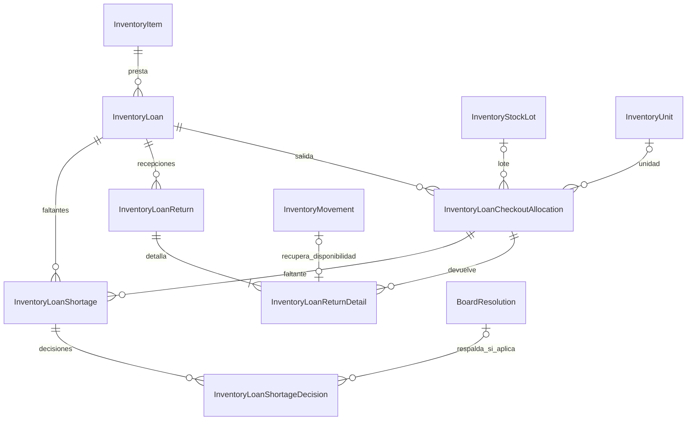
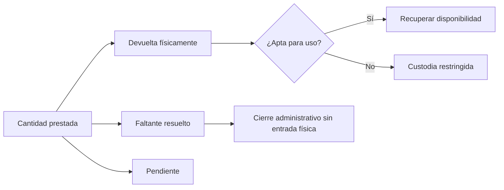
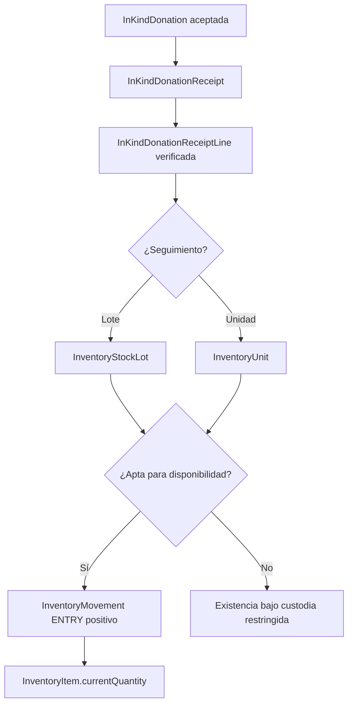

# 9.3C — Recepciones en especie, préstamos, devoluciones y pérdidas

**Estado:** INV-VAL-04/05 y DON-INV-VAL-01 confirmadas funcionalmente.
**Candidatas:** `InventoryLoanCheckoutAllocation`, `InventoryLoanReturn`, `InventoryLoanReturnDetail`, `InventoryLoanShortage`, `InventoryLoanShortageDecision`.

## D-9.3C-01 — Submodelo conceptual de préstamos

**Invariantes:** un préstamo se asocia a un único `InventoryItem`; se permite entrega por varios lotes/unidades, múltiples recepciones y condiciones diferentes. Un faltante no es una devolución física; su resolución competente permite cierre administrativo sin incrementar `currentQuantity`.

## D-9.3C-02 — Ecuación de conciliación

`Prestada = Devuelta físicamente + Faltante resuelto + Pendiente` (cantidades disjuntas). La pérdida de una unidad ya descontada al prestar no genera otra salida de disponibilidad.

## D-9.3C-03 — Donación física y stock disponible

**Invariantes:** oferta ≠ entrega; se registra todo bien aceptado bajo custodia desde la recepción, incluso si está dañado; solo cantidad habilitada modifica disponibilidad; ni recepción ni valoración patrimonial crean automáticamente `FinancialMovement` de ingreso monetario.

**Pendiente:** control de casos de reparto de lotes por condición, historia patrimonial, idempotencia de recepciones y gates `INV-LEDGER-01`/`INV-LOAN-01`.
