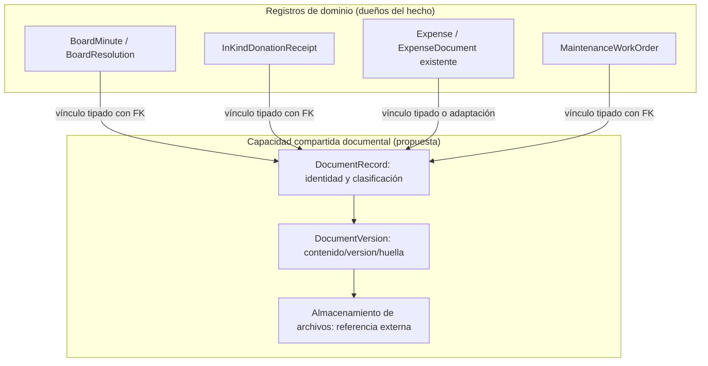
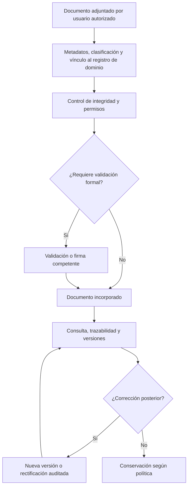

# 9.3D — Diseño de infraestructura documental transversal

**Estado funcional vigente:** `DOC-VAL-01..04` confirmadas. La estructura física, asociaciones exactas, firma digital y formatos de salida permanecen abiertos; estos diagramas no aprueban el modelo lógico.
**Procedencia:** snapshot histórico reconstruido del paquete 9.3D. Los diagramas y la tabla de temas se conservan como evidencia del análisis previo; su rótulo original de propuesta quedó **superado solo respecto de `DOC-VAL-01..04`**, no respecto de la estructura candidata pendiente.
**Objetivo:** reutilizar almacenamiento, integridad, versionado y consulta sin quitar a Gobernanza, Donaciones, Tesorería y Mantenimiento la titularidad de sus hechos.

## D-9.3D-01 — Núcleo documental transversal (candidato)

El diseño aún no decide si los vínculos serán FK desde cada entidad, tablas asociativas tipadas o una combinación. NO se recomienda imponer `entityType + entityId` como único respaldo de referencialidad para documentos institucionales. Antes de crear un núcleo nuevo, se debe revisar `ExpenseDocument` existente y toda solución documental compartida del repositorio.

## D-9.3D-02 — Ciclo documental transversal (candidato)

## Temas del snapshot histórico

La tabla siguiente refleja preguntas de trabajo del momento reconstruido. Para `DOC-VAL-01..04`, prevalecen las decisiones confirmadas del [registro vigente](../../decisions/decision-register.md); los demás puntos continúan pendientes.

| Tema | Pregunta del snapshot histórico | Estado vigente |
|---|---|---|
| Asociaciones | FK tipadas y conservación de `ExpenseDocument` existente | Estructura exacta pendiente |
| Ciclo documental | Adjuntar, verificar, emitir, sustituir, rectificar, archivar | Versionado, inmutabilidad oficial y rectificación con historia confirmados por `DOC-VAL-01`; transición física pendiente |
| Trazabilidad | Registro de actor, sello temporal, huella de contenido y referencias | Historia e integridad confirmadas por `DOC-VAL-01`; campos físicos pendientes |
| Folios | Serie, alcance, unicidad e inalterabilidad de identificadores emitidos | Serie independiente y consecutivo anual confirmados por `DOC-VAL-02/03`; estructura física pendiente |
| Seguridad | Clasificación, permisos, privacidad y acceso público cuando proceda | `PUBLIC`/`INTERNAL`/`RESTRICTED` y RBAC contextual confirmados por `DOC-VAL-04`; matriz física pendiente |
| Versiones | Control de documentos reemplazados sin eliminación de historial | Confirmado funcionalmente por `DOC-VAL-01`; estructura física pendiente |
| Firma digital | Actores y condiciones formales según normativa aplicable | Pendiente |
| Salidas | PDF y formatos exportables que la implementación soporte | Pendiente |

La fuente de diagramas técnicos (Mermaid/Markdown) NO se almacena por defecto como un documento operativo del ERP. Pertenece al repositorio/documentación del proyecto; puede referenciarse sin mezclarse con los expedientes de la ADI.
