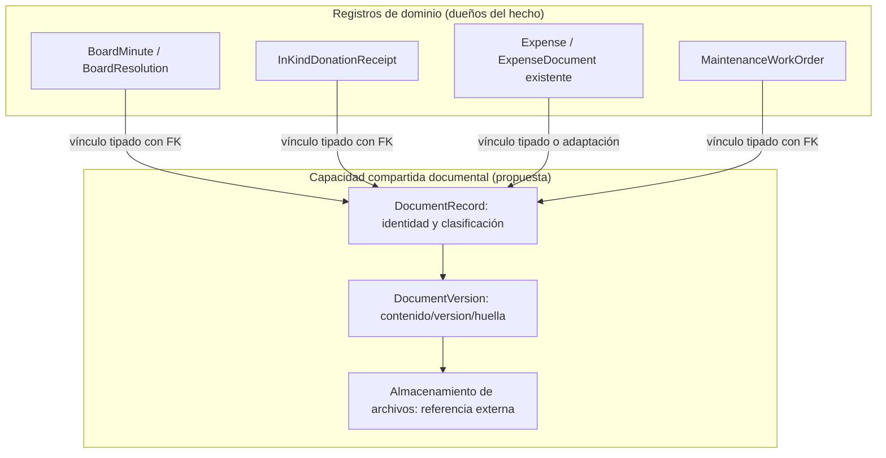
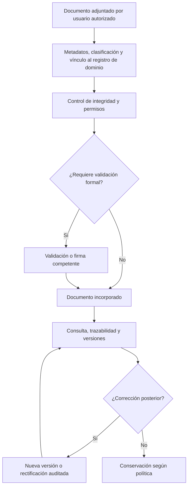

# 9.3D — Diseño de infraestructura documental transversal (PROPUESTA)

**Estado:** abierto. Estos diagramas son propuestas y NO son una aprobación del modelo lógico.
**Objetivo:** reutilizar almacenamiento, integridad, versionado y consulta sin quitar a Gobernanza, Donaciones, Tesorería y Mantenimiento la titularidad de sus hechos.

## D-9.3D-01 — Núcleo documental transversal (candidato)

El diseño aún no decide si los vínculos serán FK desde cada entidad, tablas asociativas tipadas o una combinación. NO se recomienda imponer `entityType + entityId` como único respaldo de referencialidad para documentos institucionales. Antes de crear un núcleo nuevo, se debe revisar `ExpenseDocument` existente y toda solución documental compartida del repositorio.

## D-9.3D-02 — Ciclo documental transversal (candidato)

## Decisiones que 9.3D debe producir

| Tema | Decisión pendiente |
|---|---|
| Asociaciones | FK tipadas y conservación de `ExpenseDocument` existente |
| Ciclo documental | Adjuntar, verificar, emitir, sustituir, rectificar, archivar |
| Trazabilidad | Registro de actor, sello temporal, huella de contenido y referencias |
| Folios | Serie, alcance, unicidad e inalterabilidad de identificadores emitidos |
| Seguridad | Clasificación, permisos, privacidad y acceso público cuando proceda |
| Versiones | Control de documentos reemplazados sin eliminación de historial |
| Firma digital | Actores y condiciones formales según normativa aplicable |
| Salidas | PDF y formatos exportables que la implementación soporte |

La fuente de diagramas técnicos (Mermaid/Markdown) NO se almacena por defecto como un documento operativo del ERP. Pertenece al repositorio/documentación del proyecto; puede referenciarse sin mezclarse con los expedientes de la ADI.
