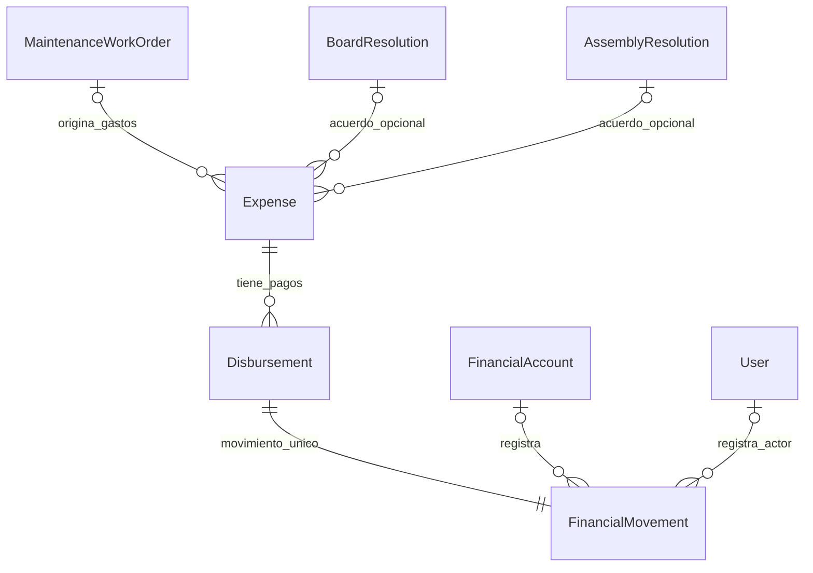
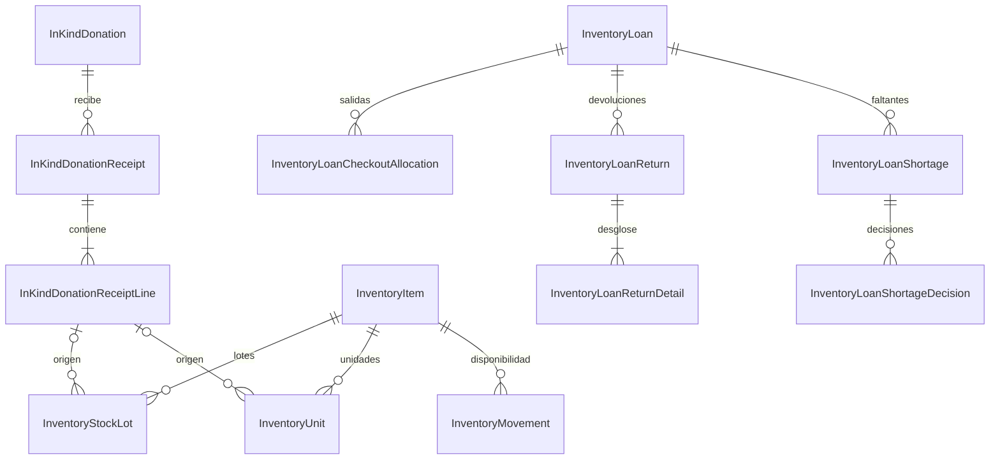
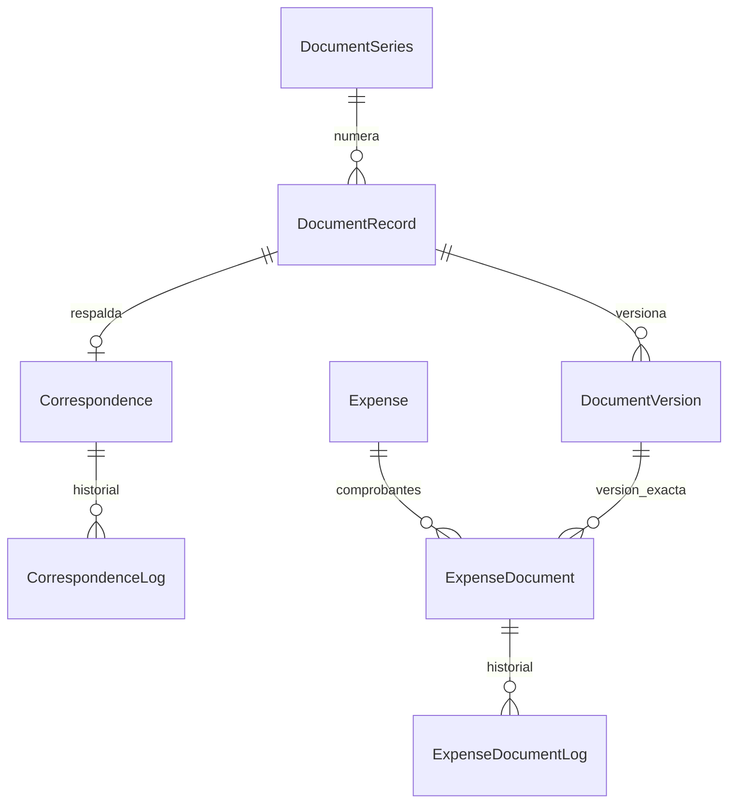

# SGI-Curime V2 — Checkpoint 9.4B: Borrador lógico relacional

**Estado:** propuesta para revisión, NO congelada; **Fecha de elaboración:** 2026-10-08.
**Baseline:** Target V1.1: 49 entidades persistentes, 1 transicional (`IdentityReconciliationManifest`), 77 relaciones maestras.
**V2:** 31 candidatas identificadas: 30 principales y una condicionada (`BoardSessionAttendance`).
**Alcance:** exclusivamente diseño; no modifica Prisma oficial, datos, migraciones ni reportes.

## 1. Decisiones confirmadas que condicionan el modelo

- **FIN-MNT-VAL-01 (B):** solo después de verificar y cerrar la orden se consolida como costo definitivo de mantenimiento.
- **FIN-MNT-VAL-02:** un anticipo pagado disminuye caja en el momento efectivo; permanece pendiente de liquidación y se aplica al costo final sin generar otra salida monetaria.
- **FIN-VAL-02:** ingreso confirmado con un destino único; sin fraccionamiento entre varias iniciativas.
- **FIN-VAL-03:** `Initiative` representa iniciativas comunitarias, sin duplicar `Event`; fondo general es destino especial.
- **INV-VAL-04/05:** devoluciones parciales, por condición, y faltantes con resolución administrativa, nunca devolución ficticia.
- **DON-INV-VAL-01:** alta física bajo custodia aceptada incluso si el bien está dañado; solo lo habilitado aumenta disponibilidad.
- **DOC-VAL-01..04:** versionado e inmutabilidad oficial, folios por serie y año, niveles `PUBLIC`, `INTERNAL`, `RESTRICTED` con RBAC contextual.

## 2. Principio contable — tres hechos distintos

1. **Gasto planificado/pendiente:** puede existir `Expense` con relación a una orden en ejecución; no integra todavía el costo final reconocido.
2. **Desembolso confirmado:** cada `Disbursement` tiene su `FinancialMovement` exclusivo. La salida efectiva afecta caja en `paidAt` independientemente del cierre.
3. **Reconocimiento definitivo:** un `Expense.maintenanceCostRecognizedAt` (campo candidato) solo se establece después del cierre verificado; el informe de costos de mantenimiento toma esa clasificación, sin crear un segundo egreso de efectivo.

El significado histórico `FinancialMovement.type = EXPENSE` expresa salida monetaria y no debe usarse como sinónimo de costo ya reconocido. El reporte de disponibilidad de efectivo y el de costos de reparaciones tienen criterios distintos. **El diseño contable completo del libro mayor/partida doble no está verificado** y no debe inferirse de este borrador.

### Diagrama ER — FIN-MNT



**Nota de cardinalidad:** en el escenario V2 simple cada `Expense` de mantenimiento refiere a **cero o una** `MaintenanceWorkOrder`; si se necesitan facturas compartidas entre órdenes distintas, debe reemplazarse por asociación específica (no dividir movimientos monetarios sin evidencia).

## 3. Extracto incremental de Prisma — NO es un `schema.prisma` completo

Este código define campos y modelos candidatos a **integrar** cuidadosamente en el esquema existente. No pegar modelos duplicados: `Expense`, `Disbursement`, `FinancialMovement` y `User` ya existen.

```prisma
enum MaintenanceWorkOrderStatus {
  DRAFT
  AUTHORIZED
  ASSIGNED
  IN_PROGRESS
  COMPLETED
  VERIFIED
  CLOSED
  CANCELLED
}

enum DisbursementPurpose {
  REGULAR
  ADVANCE
  SETTLEMENT
}

enum ExpenseType {
  OPERATING
  MAINTENANCE
  EXTRAORDINARY
}

model MaintenanceWorkOrder {
  id         Int                        @id @default(autoincrement())
  status     MaintenanceWorkOrderStatus @default(DRAFT)
  verifiedAt DateTime?
  closedAt   DateTime?
  createdAt  DateTime                   @default(now())
  updatedAt  DateTime                   @updatedAt
  expenses   Expense[]

  @@index([status, closedAt])
}

// Agregar a Expense existente, NO redeclarar el modelo:
// expenseType                    ExpenseType @default(OPERATING)
// maintenanceWorkOrderId         Int?
// maintenanceCostRecognizedAt    DateTime?
// maintenanceWorkOrder           MaintenanceWorkOrder? @relation(fields: [maintenanceWorkOrderId], references: [id], onDelete: Restrict, onUpdate: Cascade)
// @@index([maintenanceWorkOrderId])
// @@index([maintenanceCostRecognizedAt])

// Agregar a Disbursement existente, NO redeclarar el modelo:
// purpose DisbursementPurpose @default(REGULAR)

// Si se agrega BoardResolution en V2, la referencia alterna del acuerdo
// se modela en Expense y se conserva el legado AssemblyResolution hasta migración.
// boardResolutionId   Int?
// boardResolution     BoardResolution? @relation(fields: [boardResolutionId], references: [id], onDelete: Restrict, onUpdate: Cascade)
// Nota: BoardResolution debe exponer expenses Expense[] como inversa.
```

### Restricciones del dominio, y dónde aplicarlas

| Regla | Nivel de implementación |
|---|---|
| `Disbursement.movementId` único | Ya existe en V1.1: `@unique` |
| `Expense.maintenanceWorkOrderId` opcional y FK real | Prisma `@relation`, `onDelete: Restrict` |
| Una orden `CLOSED` debe estar verificada | Transacción de servicio + CHECK/trigger SQL conforme al ciclo |
| `maintenanceCostRecognizedAt` requiere orden `CLOSED`/`VERIFIED` | **Entre dos filas**: no se resuelve con `CHECK` ordinario de una sola fila; transacción + validación/trigger |
| No reconocimiento de costo duplicado | Idempotencia + transacción y clave de referencia única según evento de reconocimiento |
| Cada pago confirmado con un único movimiento y mismo monto/moneda | FK/UNIQUE + validaciones transaccionales |
| Anticipo no se vuelve a desembolsar en el cierre | Reconciliación de pagos y criterio de reporting; no crear segundo `FinancialMovement` |
| Importes positivos y fecha de pago válida | CHECK SQL en migración cuando proceda |
| Reversión/compensación de anticipos devueltos | Proceso monetario separado y auditado; no se borra un movimiento contabilizado |
| Umbrales de doble control en egresos extraordinarios | Política de autorización pendiente de formalizar; no inventar montos |

## 4. Catálogo 31 candidatas V2 — PK y FK de primera pasada

**Convención:** se propone `id Int @id @default(autoincrement())` para nuevas entidades y `onDelete: Restrict` para relaciones históricas. Todas las FKs son propuestas; la obligatoriedad exacta debe concordar con etapas de borrador/confirmación. Los actores autenticados se enlazan a `User`, y la autoridad institucional se verifica mediante `GovernanceMembership` + permisos, no solo el nombre del rol.

| Dominio | Entidad candidata | FKs candidatas relevantes / unicidad |
|---|---|---|
| Gobernanza | `BoardSession` | `termId -> GovernanceTerm`; identificador de sesión por período pendiente |
| Gobernanza | `BoardMinute` | `boardSessionId -> BoardSession` UNIQUE |
| Gobernanza | `BoardResolution` | `boardSessionId -> BoardSession`; número de acuerdo por sesión/serie pendiente |
| Gobernanza (cond.) | `BoardSessionAttendance` | `boardSessionId -> BoardSession`, `membershipId -> GovernanceMembership`, UNIQUE(par) |
| Eventos | `EventRevision` | `eventId -> Event`; UNIQUE(eventId, revisionNumber) |
| Eventos | `EventReviewDecision` | `eventRevisionId -> EventRevision`; `membershipId -> GovernanceMembership` según competencia |
| Eventos | `EventBudgetLine` | `eventId -> Event`; partida/orden local por evento pendiente |
| Donaciones | `InKindDonation` | `donorId -> Donor` cuando esté identificado/confirmado; borradores y donante sin User permitidos |
| Donaciones | `InKindDonationItem` | `donationId -> InKindDonation`; `quantity > 0` |
| Donaciones | `InKindDonationDecision` | `donationId -> InKindDonation`; `boardResolutionId -> BoardResolution` opcional; autoridad verificada |
| Donaciones | `InKindDonationReceipt` | `donationId -> InKindDonation`; responsable de recepción `User` |
| Donaciones | `InKindDonationReceiptLine` | `receiptId -> InKindDonationReceipt`; `donationItemId -> InKindDonationItem`, `itemId -> InventoryItem`; cantidad positiva |
| Inventario | `InstitutionalFacility` | `parentFacilityId -> InstitutionalFacility` opcional; prevenir ciclos |
| Inventario | `InventoryStockLot` | `itemId -> InventoryItem`; `originReceiptLineId` opcional; código único |
| Inventario | `InventoryUnit` | `itemId -> InventoryItem`; `originReceiptLineId` opcional; código patrimonial único |
| Mantenimiento | `MaintenanceIncident` | destino exacto facility/unit/lot mediante FKs alternativas + exclusividad |
| Mantenimiento | `MaintenanceWorkOrder` | `incidentId -> MaintenanceIncident` opcional (preventivo); destino físico + responsable pendientes de detalle |
| Mantenimiento | `ResourceUnavailability` | `reservableResourceId -> ReservableResource`; incidente/orden opcionales, validación de solapamiento |
| Préstamos | `InventoryLoanCheckoutAllocation` | `loanId -> InventoryLoan`; `lotId` XOR `unitId`; misma identidad de artículo |
| Préstamos | `InventoryLoanReturn` | `loanId -> InventoryLoan`, `receivedByUserId -> User` |
| Préstamos | `InventoryLoanReturnDetail` | `returnId -> InventoryLoanReturn`; `checkoutAllocationId -> InventoryLoanCheckoutAllocation`; `availableEntryMovementId -> InventoryMovement` UNIQUE opcional |
| Préstamos | `InventoryLoanShortage` | `loanId -> InventoryLoan`; `checkoutAllocationId -> InventoryLoanCheckoutAllocation` |
| Préstamos | `InventoryLoanShortageDecision` | `shortageId -> InventoryLoanShortage`; autoridad/`boardResolutionId` opcional según competencia |
| Iniciativas | `Initiative` | código único; vínculo opcional desde `Event` y `VolunteerOpportunity` |
| Documentos | `DocumentRecord` | `seriesId -> DocumentSeries`; UNIQUE(folio), UNIQUE(seriesId, folioYear, folioSequence) para documentos foliados |
| Documentos | `DocumentVersion` | `documentId -> DocumentRecord`; UNIQUE(documentId, versionNumber); checksum e inmutabilidad |
| Documentos | `DocumentSeries` | `code` UNIQUE; numeración anual separada |
| Donantes | `Donor` | `personId -> Person` opcional y UNIQUE cuando tipo PERSON; identificación jurídica externa controlada |
| Documentos financieros | `ExpenseDocumentLog` | `expenseDocumentId -> ExpenseDocument`; trazabilidad append-only |
| Correspondencia | `Correspondence` | `documentRecordId -> DocumentRecord` UNIQUE; folio canónico únicamente en documento |
| Correspondencia | `CorrespondenceLog` | `correspondenceId -> Correspondence`; autor `User` opcional según operación; append-only |

**TOTAL:** 31 candidatas enumeradas, 30 principales + una condicionada (`BoardSessionAttendance`); 49 persistentes existentes (Target V1.1). No sumar asociaciones especializadas aún no decididas ni contar enums como entidades.

### ER — Inventario y donaciones



### ER — Documentos institucionales



## 5. Restricciones que Prisma no implementa de forma automática

- `CHECK` condicionado por tipo de destino (`INCOME -> initiativeId XOR generalFund`); el formato podría implementarse en migración SQL, usando tipos y nulabilidad convenidos.
- `CHECK` del número positivo y de la coherencia entre tipo físico, unidades y lotes; sumas agregadas necesitan transacciones o validación adicional.
- Índices parciales para estados activos exclusivos y combinaciones específicas; usar SQL en migraciones si Prisma no expresa el predicado.
- Prohibición de cambio/eliminación de versiones oficiales, bitácoras de correspondencia y movimientos contabilizados; permisos de DB, triggers/política de escrituras y evidencia auditada.
- Exclusiones temporales de reservas/bloqueos (rangos superpuestos), coherencia de estados y verificación de competencia de aprobadores.
- El pointer opcional `DocumentRecord.currentVersionId`, propuesto en 9.3D, genera un ciclo si se añade directamente. En 9.4C decidir si se **deriva** de versiones, o si es un FK nullable con garantía de pertenencia (sin introducir inconsistencia).

## 6. Gates de migración que permanecen

`ID-01`, `GOV-HIST-01`, `FIN-ORIGIN-01`, `FIN-DON-01`, `INV-LEDGER-01`, `INV-LOAN-01`, `ASM-ATT-01`, `ASM-DATE-01`, `RES-STATUS-01` y el nuevo `DOC-HIST-01` deben resolverse por etapas. La existencia de modelos en Prisma no demuestra backfill ni cierre de gates.

## 7. Próximo subcheckpoint propuesto

**9.4B-1 (FIN/MNT):** definir `Expense.maintenanceWorkOrderId`, señal de reconocimiento, clasificación `DisbursementPurpose`, autoridad financiera y reglas de arqueo y reversión; cerrar qué constituye una liquidación completa.
**9.4B-2 (Inventario/Donaciones):** exclusividad de origen lote/unidad, detalles, faltantes y recepción parcial.
**9.4B-3 (Identidad/Correspondencia/Documentación):** donantes externos, folios por serie-año, versiones, bitácoras y FK de evidencia.
**9.4B-4 (Gobernanza/Eventos/Iniciativas):** fuentes autorizantes, decisiones revisables, destinos de ingresos y links a voluntariado.
**9.4C:** 1FN–3FN, constraints físicos, migraciones y diagramas definitivos, después de resolver decisiones pendientes.
