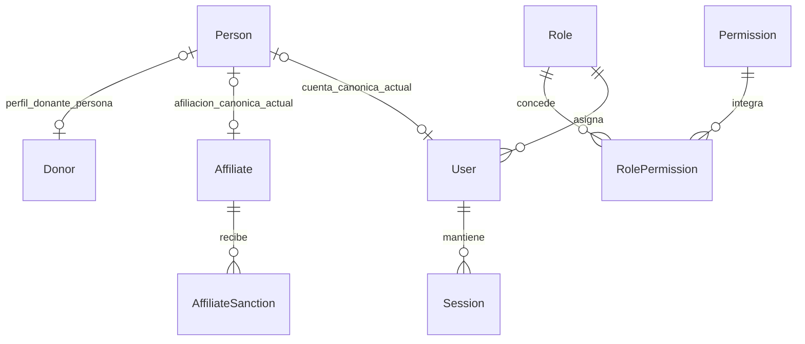
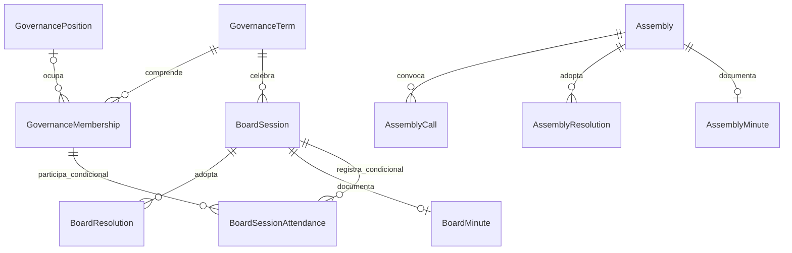
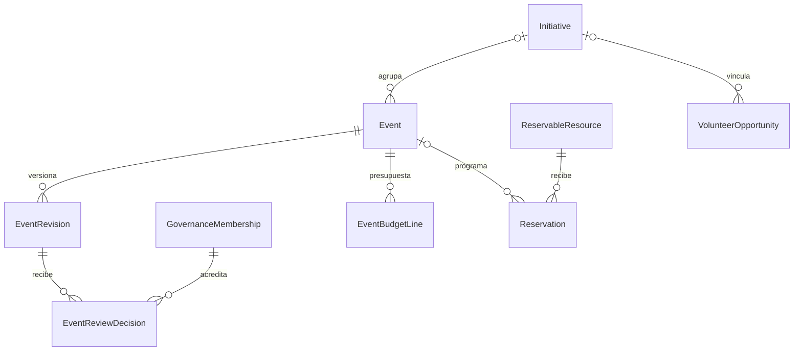
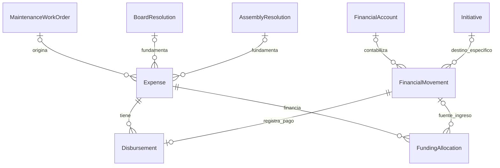
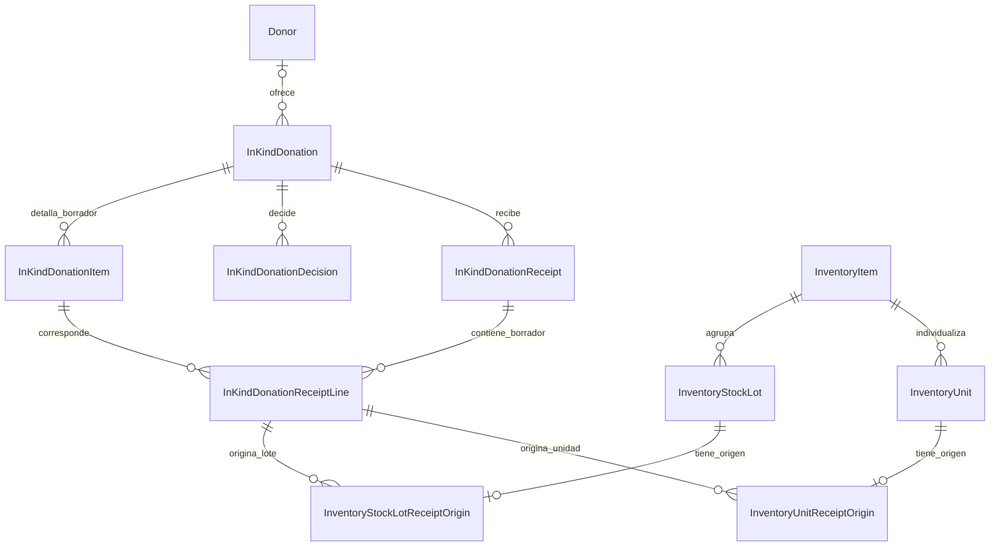
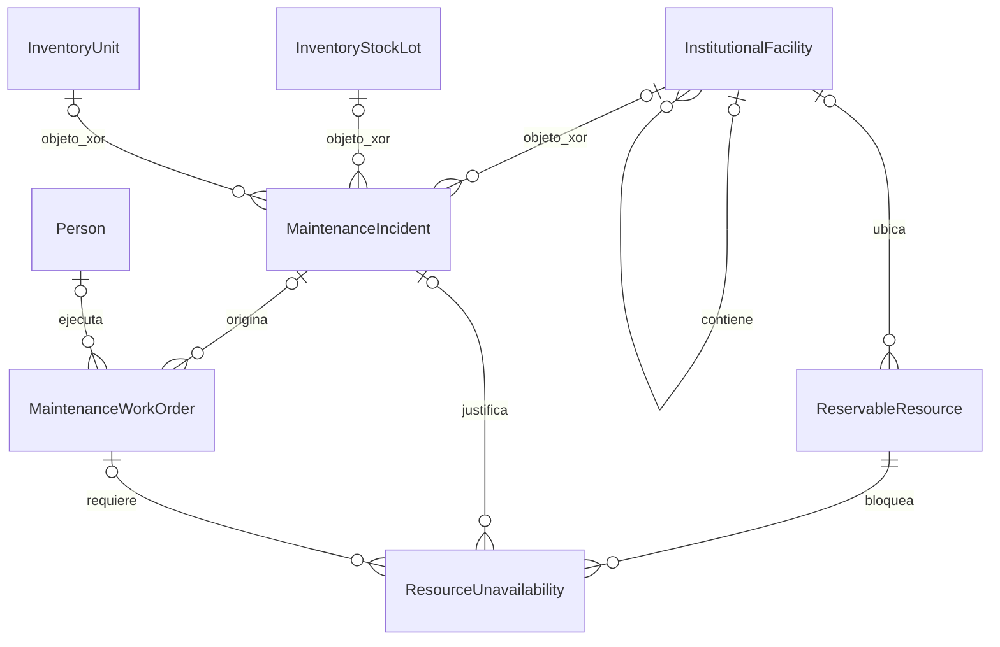
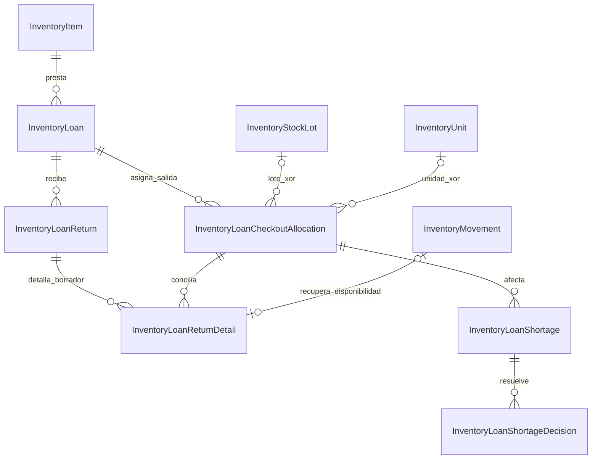
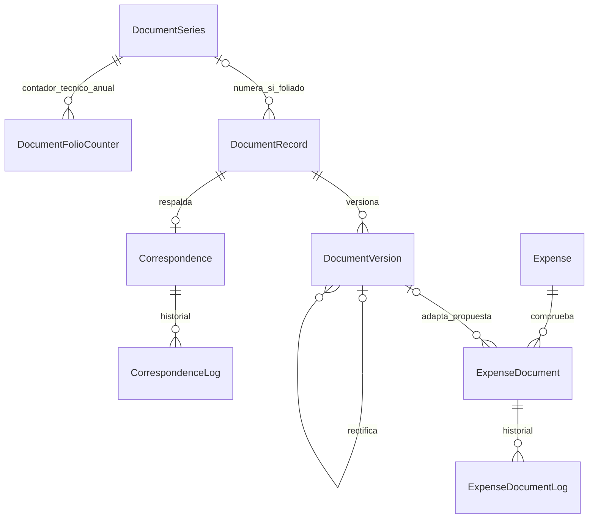

# Checkpoint 9.4B — matriz lógica de relaciones

**Estado:** conciliación lógica completa; no congelada ni implementada.

**Baseline autoritativa:** Prisma fijado en `e8e2beb33eea8c1207fe77fe65dbd3228362bc5f`, ver [evidencia](../../baseline-v1.1/README.md).

**Conteo auditable:** sección A contiene exactamente **77** campos propietarios `@relation(fields: ...)` de las 49 entidades persistentes. Relación transicional y relaciones V2 están separadas y no alteran ese total.

## Leyenda y lectura

- Estados: **BASELINE V1.1**, **DECISIÓN VALIDADA**, **PROPUESTA ARQUITECTÓNICA**, **CONDICIONADA**.
- Tratamiento: **KEEP** conserva contrato; **REFINE** conserva relación y endurece/completa semántica; **REPLACE** mantiene historia durante transición pero cambia destino lógico; **RETIRE** elimina solo tras gate. Ninguna fila autoriza DDL.
- Cardinalidad `Padre 1 ← 0..N Hijo` expresa cada hijo con FK obligatoria; `Padre 0..1 ← 0..N Hijo`, FK nullable; `← 0..1` del lado hijo indica FK UQ.
- Acciones se expresan `ON DELETE / ON UPDATE`. Todas las baseline se transcriben del Prisma fijado.
- Fuentes: `S` schema fijado; `IR` integrity-rules V1.1; `DR` [registro V2](../../../architecture/decisions/decision-register.md); `9.x` checkpoint enlazado; `A` [catálogo lógico](entity-catalog.md).

## A. Reconciliación nominal de 77 relaciones propietarias BASELINE V1.1

| ID | Dominio | Propietario.campo FK | Referencia | Nulabilidad / cardinalidad | UQ | Acciones | Tratamiento V2 | Fuente / validación |
|---|---|---|---|---|---|---|---|---|
| B001 | IAM | `RolePermission.roleId` | `Role.id` | NOT NULL; `Role 1 ← 0..N RolePermission` | PK par | CASCADE / CASCADE | KEEP | S, `SEC-02`; V |
| B002 | IAM | `RolePermission.permissionId` | `Permission.id` | NOT NULL; `Permission 1 ← 0..N RolePermission` | PK par | CASCADE / CASCADE | KEEP | S, `SEC-02`; V |
| B003 | IAM | `User.roleId` | `Role.id` | NOT NULL; `Role 1 ← 0..N User` | no | RESTRICT / CASCADE | KEEP | S, `SEC-04`; V |
| B004 | Identidad | `User.personId` | `Person.id` | nullable hoy; `Person 0..1 ← 0..1 User` | sí | RESTRICT / CASCADE | REFINE: NOT NULL tras `ID-01` | S, IR `ID-R02`; V |
| B005 | IAM | `Session.userId` | `User.id` | NOT NULL; `User 1 ← 0..N Session` | no | RESTRICT / CASCADE | KEEP | S; V |
| B006 | Auditoría | `AuditLog.userId` | `User.id` | nullable; `User 0..1 ← 0..N AuditLog` | no | SET NULL / CASCADE | KEEP | S; V |
| B007 | IAM | `PasswordResetToken.userId` | `User.id` | NOT NULL; `User 1 ← 0..N Token` | no | CASCADE / CASCADE | KEEP | S, `SEC-07`; V |
| B008 | IAM | `AccountActivationToken.userId` | `User.id` | NOT NULL; `User 1 ← 0..N Token` | no | CASCADE / CASCADE | KEEP | S, `SEC-07`; V |
| B009 | Identidad | `UserRequest.reviewedById` | `User.id` | nullable; `User 0..1 ← 0..N UserRequest` | no | SET NULL / CASCADE | KEEP | S; V |
| B010 | Identidad | `UserRequest.personId` | `Person.id` | nullable; `Person 0..1 ← 0..N UserRequest` | no | SET NULL / CASCADE | KEEP | S, `ID-R04`; V |
| B011 | Afiliación | `Affiliate.personId` | `Person.id` | nullable hoy; `Person 0..1 ← 0..1 Affiliate` | sí | RESTRICT / CASCADE | REFINE: NOT NULL tras `ID-01` | S, IR `ID-R03`; V |
| B012 | Afiliación | `AffiliateRequest.reviewedById` | `User.id` | nullable; `User 0..1 ← 0..N AffiliateRequest` | no | SET NULL / CASCADE | KEEP | S; V |
| B013 | Afiliación | `AffiliateRequest.personId` | `Person.id` | nullable; `Person 0..1 ← 0..N AffiliateRequest` | no | SET NULL / CASCADE | KEEP | S, `ID-R04`; V |
| B014 | Afiliación | `AffiliateSanction.affiliateId` | `Affiliate.id` | NOT NULL; `Affiliate 1 ← 0..N Sanction` | no | RESTRICT / CASCADE | KEEP | S; V |
| B015 | Afiliación | `AffiliateSanction.createdById` | `User.id` | NOT NULL; `User 1 ← 0..N Sanction` | no | RESTRICT / CASCADE | KEEP | S; V |
| B016 | Gobernanza | `GovernanceMembership.termId` | `GovernanceTerm.id` | NOT NULL; `Term 1 ← 0..N Membership` | no | RESTRICT / CASCADE | KEEP | S; V |
| B017 | Gobernanza | `GovernanceMembership.positionId` | `GovernancePosition.id` | nullable; `Position 0..1 ← 0..N Membership` | no | RESTRICT / CASCADE | REFINE tras `GOV-HIST-01`, sin fabricar historia | S, IR `GOV-R04`; V |
| B018 | Gobernanza | `GovernanceMembership.affiliateId` | `Affiliate.id` | nullable; `Affiliate 0..1 ← 0..N Membership` | no | RESTRICT / CASCADE | REFINE tras `GOV-HIST-01` | S; V |
| B019 | Gobernanza | `GovernanceMembership.appointedByAssemblyId` | `Assembly.id` | nullable; `Assembly 0..1 ← 0..N Membership` | no | SET NULL / CASCADE | KEEP | S, `GOV-R07`; V |
| B020 | Asambleas | `AssemblyCall.assemblyId` | `Assembly.id` | NOT NULL; `Assembly 1 ← 0..N Call` | par con `callNumber` | CASCADE / CASCADE | KEEP | S, `ASM-R03`; V |
| B021 | Asambleas | `AssemblyConvocation.assemblyId` | `Assembly.id` | NOT NULL; `Assembly 1 ← 0..N Convocation` | par con `affiliateId` | CASCADE / CASCADE | KEEP | S, `ASM-R05`; V |
| B022 | Asambleas | `AssemblyConvocation.affiliateId` | `Affiliate.id` | NOT NULL; `Affiliate 1 ← 0..N Convocation` | par con `assemblyId` | RESTRICT / CASCADE | KEEP | S; V |
| B023 | Asambleas | `AssemblyConvocation.governanceMembershipId` | `GovernanceMembership.id` | nullable; `Membership 0..1 ← 0..N Convocation` | no | SET NULL / CASCADE | KEEP; validar afiliado coincidente | S, `ASM-R07`, `GOV-HIST-01`; V |
| B024 | Asambleas | `AssemblyAttendance.convocationId` | `AssemblyConvocation.id` | nullable hoy; `Convocation 0..1 ↔ 0..1 Attendance` | sí | CASCADE / CASCADE | REFINE tras `ASM-ATT-01` | S, `ASM-R08`; V |
| B025 | Asambleas | `AbsenceJustification.attendanceId` | `AssemblyAttendance.id` | nullable hoy; `Attendance 0..1 ↔ 0..1 Justification` | sí | CASCADE / CASCADE | REFINE tras `ASM-ATT-01` | S, `ASM-R10`; V |
| B026 | Asambleas | `AbsenceJustification.reviewedById` | `User.id` | nullable; `User 0..1 ← 0..N Justification` | no | SET NULL / CASCADE | KEEP | S; V |
| B027 | Asambleas | `AssemblyMinute.assemblyId` | `Assembly.id` | NOT NULL; `Assembly 1 ↔ 0..1 Minute` | sí | RESTRICT / CASCADE | KEEP; lifecycle sigue `ASM-R12` | S, IR; V |
| B028 | Asambleas | `AssemblyResolution.assemblyId` | `Assembly.id` | NOT NULL; `Assembly 1 ← 0..N Resolution` | no | RESTRICT / CASCADE | KEEP | S; V |
| B029 | Reservas | `Reservation.resourceId` | `ReservableResource.id` | NOT NULL; `Resource 1 ← 0..N Reservation` | no | RESTRICT / CASCADE | KEEP | S; V |
| B030 | Reservas | `Reservation.requesterUserId` | `User.id` | NOT NULL; `User 1 ← 0..N Reservation` | no | RESTRICT / CASCADE | KEEP | S; V |
| B031 | Reservas | `Reservation.approvedById` | `User.id` | nullable; `User 0..1 ← 0..N Reservation` | no | SET NULL / CASCADE | KEEP | S; V |
| B032 | Eventos | `Reservation.eventId` | `Event.id` | nullable; `Event 0..1 ← 0..N Reservation` | no | SET NULL / CASCADE | KEEP | S, `RES-07`; V |
| B033 | Finanzas | `FinancialCharge.reservationId` | `Reservation.id` | NOT NULL; `Reservation 1 ↔ 0..1 Charge` | sí | RESTRICT / CASCADE | KEEP | S, `RES-08`; V |
| B034 | Finanzas | `Payment.chargeId` | `FinancialCharge.id` | NOT NULL; `Charge 1 ← 0..N Payment` | no | RESTRICT / CASCADE | KEEP | S; V |
| B035 | Finanzas | `Payment.movementId` | `FinancialMovement.id` | nullable hoy; `Movement 0..1 ↔ 0..1 Payment` | sí | RESTRICT / CASCADE | REFINE: NOT NULL tras `FIN-ORIGIN-01` | S, `FIN-R09/18`; V |
| B036 | Finanzas | `Payment.recordedById` | `User.id` | nullable; `User 0..1 ← 0..N Payment` | no | SET NULL / CASCADE | KEEP | S; V |
| B037 | Finanzas | `FinancialMovement.accountId` | `FinancialAccount.id` | nullable hoy; `Account 0..1 ← 0..N Movement` | no | RESTRICT / CASCADE | REFINE: NOT NULL tras reconciliación | S, `FIN-R01`; V |
| B038 | Finanzas | `FinancialMovement.recordedById` | `User.id` | nullable; `User 0..1 ← 0..N Movement` | no | RESTRICT / CASCADE | KEEP | S; V |
| B039 | Finanzas | `FinancialMovement.voidedById` | `User.id` | nullable; `User 0..1 ← 0..N Movement` | no | SET NULL / CASCADE | KEEP | S, `FIN-R06`; V |
| B040 | Finanzas | `FinancialMovement.reversalOfId` | `FinancialMovement.id` | nullable; `Movement 0..1 ↔ 0..1 Reversal` | sí | RESTRICT / CASCADE | KEEP | S, `FIN-R07/08`; V |
| B041 | Donaciones | `Donation.donorPersonId` | `Person.id` | nullable; `Person 0..1 ← 0..N Donation` | no | SET NULL / CASCADE | REPLACE por `donorId → Donor`; conservar hasta gate | S, A; V |
| B042 | Donaciones | `Donation.recordedById` | `User.id` | NOT NULL; `User 1 ← 0..N Donation` | no | RESTRICT / CASCADE | KEEP | S; V |
| B043 | Donaciones | `Donation.cancelledById` | `User.id` | nullable; `User 0..1 ← 0..N Donation` | no | SET NULL / CASCADE | KEEP | S; V |
| B044 | Donaciones | `Donation.originalMovementId` | `FinancialMovement.id` | nullable hoy; `Movement 0..1 ↔ 0..1 Donation` | sí | RESTRICT / CASCADE | REFINE: NOT NULL tras `FIN-DON-01` | S, `FIN-R10/19`; V |
| B045 | Finanzas | `Expense.authorizationResolutionId` | `AssemblyResolution.id` | nullable; `Resolution 0..1 ← 0..N Expense` | no | SET NULL / CASCADE | REFINE: conservar y añadir alternativa de Junta con XOR | S, `FIN-R14`, `FIN-VAL-01`; V |
| B046 | Finanzas | `ExpenseDocument.expenseId` | `Expense.id` | NOT NULL; `Expense 1 ← 0..N Document` | no | CASCADE / CASCADE | KEEP; bitácora V2 no cambia ownership | S, `FIN-R15/22`; V |
| B047 | Finanzas | `Disbursement.expenseId` | `Expense.id` | NOT NULL; **`Expense 1 ← 0..N Disbursement`** | no | RESTRICT / CASCADE | KEEP; cardinalidad aprobada 1:N | S, DR `FIN-MNT-VAL-02`; V |
| B048 | Finanzas | `Disbursement.movementId` | `FinancialMovement.id` | NOT NULL; **`Movement 1 ↔ 0..1 Disbursement`** | sí | RESTRICT / CASCADE | KEEP; exactamente un movimiento por desembolso | S, DR `INT-01`, `FIN-R12/20`; V |
| B049 | Finanzas | `FundingAllocation.expenseId` | `Expense.id` | NOT NULL; `Expense 1 ← 0..N Allocation` | no | RESTRICT / CASCADE | KEEP | S, `FIN-R25`; V |
| B050 | Finanzas | `FundingAllocation.incomeMovementId` | `FinancialMovement.id` | nullable; `Movement 0..1 ← 0..N Allocation` | no | RESTRICT / CASCADE | KEEP; no confundir con destino único de ingreso | S, `FIN-R16`; V |
| B051 | Inventario | `InventoryItem.categoryId` | `InventoryCategory.id` | NOT NULL; `Category 1 ← 0..N Item` | no | RESTRICT / CASCADE | KEEP | S; V |
| B052 | Inventario | `InventoryMovement.itemId` | `InventoryItem.id` | NOT NULL; `Item 1 ← 0..N Movement` | no | RESTRICT / CASCADE | KEEP | S, `INV-R01..04`; V |
| B053 | Inventario | `InventoryMovement.createdById` | `User.id` | nullable; `User 0..1 ← 0..N Movement` | no | SET NULL / CASCADE | KEEP | S; V |
| B054 | Préstamos | `InventoryLoan.itemId` | `InventoryItem.id` | NOT NULL; `Item 1 ← 0..N Loan` | no | RESTRICT / CASCADE | KEEP; raíz reutilizada, no `AssetLoan` | S, `INV-R09`; V |
| B055 | Préstamos | `InventoryLoan.borrowerAffiliateId` | `Affiliate.id` | nullable; `Affiliate 0..1 ← 0..N Loan` | no | SET NULL / CASCADE | KEEP | S; V |
| B056 | Préstamos | `InventoryLoan.createdById` | `User.id` | nullable; `User 0..1 ← 0..N Loan` | no | SET NULL / CASCADE | KEEP | S; V |
| B057 | Préstamos | `InventoryLoan.receivedById` | `User.id` | nullable; `User 0..1 ← 0..N Loan` | no | SET NULL / CASCADE | REFINE: nuevos retornos registran receptor por evento | S, 9.3C; V |
| B058 | Préstamos | `InventoryLoan.cancelledById` | `User.id` | nullable; `User 0..1 ← 0..N Loan` | no | SET NULL / CASCADE | KEEP | S; V |
| B059 | Préstamos | `InventoryLoan.checkoutMovementId` | `InventoryMovement.id` | nullable; `Movement 0..1 ↔ 0..1 Loan` | sí | RESTRICT / CASCADE | REFINE: conservar agregado; allocations detallan salida tras `INV-LOAN-01` | S, `INV-R08/11`; V |
| B060 | Préstamos | `InventoryLoan.returnMovementId` | `InventoryMovement.id` | nullable; `Movement 0..1 ↔ 0..1 Loan` | sí | RESTRICT / CASCADE | REFINE: retorno parcial migra a detalles sin inventar vínculos | S, `INV-LOAN-01`, 9.3C; V |
| B061 | Préstamos | `InventoryLoan.cancellationMovementId` | `InventoryMovement.id` | nullable; `Movement 0..1 ↔ 0..1 Loan` | sí | RESTRICT / CASCADE | KEEP durante extensión V2 | S, `INV-R08/11`; V |
| B062 | Voluntariado | `VolunteerOpportunity.createdByUserId` | `User.id` | NOT NULL; `User 1 ← 0..N Opportunity` | no | RESTRICT / CASCADE | KEEP | S; V |
| B063 | Voluntariado | `VolunteerSession.opportunityId` | `VolunteerOpportunity.id` | NOT NULL; `Opportunity 1 ← 0..N Session` | no | RESTRICT / CASCADE | KEEP | S; V |
| B064 | Voluntariado | `VolunteerApplication.opportunityId` | `VolunteerOpportunity.id` | NOT NULL; `Opportunity 1 ← 0..N Application` | no | RESTRICT / CASCADE | KEEP | S; V |
| B065 | Voluntariado | `VolunteerApplication.personId` | `Person.id` | nullable; `Person 0..1 ← 0..N Application` | no | SET NULL / CASCADE | KEEP | S, `VOL-I09/15`; V |
| B066 | Voluntariado | `VolunteerApplication.reviewedByUserId` | `User.id` | nullable; `User 0..1 ← 0..N Application` | no | SET NULL / CASCADE | KEEP | S; V |
| B067 | Voluntariado | `VolunteerParticipation.opportunityId` | `VolunteerOpportunity.id` | NOT NULL; `Opportunity 1 ← 0..N Participation` | par con `personId` | RESTRICT / CASCADE | KEEP | S, `VOL-I03`; V |
| B068 | Voluntariado | `VolunteerParticipation.personId` | `Person.id` | NOT NULL; `Person 1 ← 0..N Participation` | par con `opportunityId` | RESTRICT / CASCADE | KEEP | S, `VOL-I03/15`; V |
| B069 | Voluntariado | `VolunteerParticipation.applicationId` | `VolunteerApplication.id` | NOT NULL; `Application 1 ↔ 0..1 Participation` | sí | RESTRICT / CASCADE | KEEP | S, `VOL-I04`; V |
| B070 | Voluntariado | `VolunteerAttendance.participationId` | `VolunteerParticipation.id` | NOT NULL; `Participation 1 ← 0..N Attendance` | par con `sessionId` | RESTRICT / CASCADE | KEEP | S, `VOL-I05`; V |
| B071 | Voluntariado | `VolunteerAttendance.sessionId` | `VolunteerSession.id` | NOT NULL; `Session 1 ← 0..N Attendance` | par con `participationId` | RESTRICT / CASCADE | KEEP | S, `VOL-I05`; V |
| B072 | Voluntariado | `VolunteerAttendance.recordedByUserId` | `User.id` | NOT NULL; `User 1 ← 0..N Attendance` | no | RESTRICT / CASCADE | KEEP | S; V |
| B073 | Emprendimiento | `VentureAssociation.personId` | `Person.id` | NOT NULL; `Person 1 ← 0..N Association` | parcial abierta | RESTRICT / CASCADE | KEEP | S, `ENT-I04/05`; V |
| B074 | Emprendimiento | `VentureAssociation.ventureId` | `Venture.id` | NOT NULL; `Venture 1 ← 0..N Association` | parcial abierta | RESTRICT / CASCADE | KEEP | S, `ENT-I04/05`; V |
| B075 | Emprendimiento | `VentureRequest.reconciledPersonId` | `Person.id` | nullable; `Person 0..1 ← 0..N Request` | no | SET NULL / CASCADE | KEEP | S; V |
| B076 | Emprendimiento | `VentureRequest.ventureId` | `Venture.id` | nullable; `Venture 0..1 ← 0..N Request` | no | RESTRICT / CASCADE | KEEP | S, `ENT-I06/07`; V |
| B077 | Emprendimiento | `VentureRequestRevision.requestId` | `VentureRequest.id` | NOT NULL; `Request 1 ← 0..N Revision` | par con `revisionNumber` | RESTRICT / CASCADE | KEEP | S, `ENT-I09/10`; V |

**Resultado de conciliación:** 77/77 filas únicas por `(modelo propietario, campo FK)`. Tratamientos: 63 KEEP, 13 REFINE, 1 REPLACE, 0 RETIRE inmediato. `Donation.donorPersonId` solo se retira después de poblar/verificar `Donation.donorId`; snapshots no se borran.

### Relación transicional separada

| ID | Propietario.campo | Referencia | Cardinalidad / acciones | Tratamiento |
|---|---|---|---|---|
| T001 | `IdentityReconciliationManifest.selectedPersonId?` | `Person.id` | `Person 0..1 ← 0..N Manifest`; SET NULL / CASCADE | RETIRE junto con manifiesto solo al cerrar `ID-01` |

## B. Relaciones V2 nuevas o modificadas — fuera del conteo 77

Todas son **PROPUESTA ARQUITECTÓNICA**, excepto cardinalidad/semántica marcada por decisión. `RESTRICT / CASCADE` es default durable; actores opcionales usan `SET NULL / CASCADE`. Claves compuestas y XOR: [restricciones](constraint-matrix.md).

| ID | Propietario.campo FK | Referencia | Nulabilidad / cardinalidad | UQ / acciones | Estado y fuente |
|---|---|---|---|---|---|
| V001 | `BoardSession.termId` | `GovernanceTerm.id` | NOT NULL; `Term 1 ← 0..N Session` | `(termId, sessionNumber)`; RESTRICT/CASCADE | P; 9.2A |
| V002 | `BoardMinute.boardSessionId` | `BoardSession.id` | NOT NULL; `Session 1 ↔ 0..1 Minute` | UQ; RESTRICT/CASCADE | P; lifecycle abierto |
| V003 | `BoardResolution.boardSessionId` | `BoardSession.id` | NOT NULL; `Session 1 ← 0..N Resolution` | par número; RESTRICT/CASCADE | P; 9.2A |
| V004 | `BoardSessionAttendance.boardSessionId` | `BoardSession.id` | NOT NULL; `Session 1 ← 0..N Attendance` | par; RESTRICT/CASCADE | **CONDICIONADA** |
| V005 | `BoardSessionAttendance.membershipId` | `GovernanceMembership.id` | NOT NULL; `Membership 1 ← 0..N Attendance` | par; RESTRICT/CASCADE | **CONDICIONADA** |
| V006 | `EventRevision.eventId` | `Event.id` | NOT NULL; `Event 1 ← 0..N Revision` | `(eventId, revisionNumber)`; RESTRICT/CASCADE | P; 9.2B |
| V007 | `EventRevision.submittedByUserId?` | `User.id` | nullable; `User 0..1 ← 0..N Revision` | SET NULL/CASCADE | P |
| V008 | `EventReviewDecision.eventRevisionId` | `EventRevision.id` | NOT NULL; `Revision 1 ← 0..N Decision` | RESTRICT/CASCADE | P; 9.2B |
| V009 | `EventReviewDecision.membershipId` | `GovernanceMembership.id` | NOT NULL; `Membership 1 ← 0..N Decision` | RESTRICT/CASCADE | P; competencia |
| V010 | `EventReviewDecision.decidedByUserId?` | `User.id` | nullable; `User 0..1 ← 0..N Decision` | SET NULL/CASCADE | P; cuenta ≠ autoridad |
| V011 | `EventBudgetLine.eventId` | `Event.id` | NOT NULL; `Event 1 ← 0..N Line` | `(eventId,lineNumber)`; RESTRICT/CASCADE | P; 9.2B |
| V012 | `InKindDonation.donorId?` | `Donor.id` | nullable solo DRAFT; no-DRAFT exige `Donor 1 ← 0..N Donation` | SET NULL/CASCADE | P; OD-10; persona/organización, nunca `User` requerido |
| V013 | `InKindDonation.recordedByUserId?` | `User.id` | nullable; `User 0..1 ← 0..N Donation` | SET NULL/CASCADE | P |
| V014 | `InKindDonationItem.donationId` | `InKindDonation.id` | NOT NULL; `Donation 1 ← 0..N Item` en borrador; 1..N al someter | par línea; RESTRICT/CASCADE | P; `DON-VAL-04` |
| V015 | `InKindDonationDecision.donationId` | `InKindDonation.id` | NOT NULL; `Donation 1 ← 0..N Decision` | RESTRICT/CASCADE | P |
| V016 | `InKindDonationDecision.membershipId` | `GovernanceMembership.id` | NOT NULL; `Membership 1 ← 0..N Decision` | RESTRICT/CASCADE | P; `DON-VAL-05/07` |
| V017 | `InKindDonationDecision.boardResolutionId?` | `BoardResolution.id` | nullable; `Resolution 0..1 ← 0..N Decision` | RESTRICT/CASCADE | P |
| V018 | `InKindDonationDecision.decidedByUserId?` | `User.id` | nullable; `User 0..1 ← 0..N Decision` | SET NULL/CASCADE | P |
| V019 | `InKindDonationReceipt.donationId` | `InKindDonation.id` | NOT NULL; `Donation 1 ← 0..N Receipt` | par número; RESTRICT/CASCADE | P; `DON-VAL-06` |
| V020 | `InKindDonationReceipt.receivedByUserId` | `User.id` | NOT NULL; `User 1 ← 0..N Receipt` | RESTRICT/CASCADE | P |
| V021 | `InKindDonationReceiptLine.receiptId` | `InKindDonationReceipt.id` | NOT NULL; `Receipt 1 ← 0..N Line` en borrador; 1..N al confirmar | par línea; RESTRICT/CASCADE | P |
| V022 | `InKindDonationReceiptLine.donationItemId` | `InKindDonationItem.id` | NOT NULL; `Item 1 ← 0..N ReceiptLine` | RESTRICT/CASCADE | P; recepción parcial |
| V023 | `InKindDonationReceiptLine.itemId` | `InventoryItem.id` | NOT NULL; `InventoryItem 1 ← 0..N ReceiptLine` | RESTRICT/CASCADE | P; `DON-INV-VAL-01` |
| V024 | `InstitutionalFacility.parentFacilityId?` | `InstitutionalFacility.id` | nullable; `Facility 0..1 ← 0..N Child` | RESTRICT/CASCADE | P; acíclica |
| V025 | `ReservableResource.facilityId?` | `InstitutionalFacility.id` | nullable; `Facility 0..1 ← 0..N Resource` | RESTRICT/CASCADE | P; 9.2D |
| V026 | `InventoryStockLot.itemId` | `InventoryItem.id` | NOT NULL; `Item 1 ← 0..N Lot` | RESTRICT/CASCADE | P; `INV-VAL-01` |
| V027 | `InventoryStockLotReceiptOrigin.lotId` | `InventoryStockLot.id` | NOT NULL; `Lot 1 ↔ 0..1 Origin` | UQ; RESTRICT/CASCADE | P técnica; 0..1 procedencia por lote |
| V028 | `InventoryStockLotReceiptOrigin.receiptLineId` | `InKindDonationReceiptLine.id` | NOT NULL; `Line 1 ← 0..N LotOrigin` | RESTRICT/CASCADE | P técnica; partición física justificada; mismo item por trigger/TX |
| V029 | `InventoryUnit.itemId` | `InventoryItem.id` | NOT NULL; `Item 1 ← 0..N Unit` | RESTRICT/CASCADE | P; `INV-VAL-01` |
| V030 | `InventoryUnitReceiptOrigin.unitId` | `InventoryUnit.id` | NOT NULL; `Unit 1 ↔ 0..1 Origin` | UQ; RESTRICT/CASCADE | P técnica; 0..1 procedencia por unidad |
| V031 | `InventoryUnitReceiptOrigin.receiptLineId` | `InKindDonationReceiptLine.id` | NOT NULL; `Line 1 ← 0..N UnitOrigin` | RESTRICT/CASCADE | P técnica; partición física justificada; mismo item por trigger/TX |
| V032 | `MaintenanceIncident.facilityId?` | `InstitutionalFacility.id` | XOR target; `Facility 0..1 ← 0..N Incident` | RESTRICT/CASCADE | P; `INV-VAL-02` |
| V033 | `MaintenanceIncident.stockLotId?` | `InventoryStockLot.id` | XOR target; `Lot 0..1 ← 0..N Incident` | RESTRICT/CASCADE | P |
| V034 | `MaintenanceIncident.unitId?` | `InventoryUnit.id` | XOR target; `Unit 0..1 ← 0..N Incident` | RESTRICT/CASCADE | P |
| V035 | `MaintenanceIncident.reportedByPersonId?` | `Person.id` | nullable; `Person 0..1 ← 0..N Incident` | SET NULL/CASCADE | P |
| V036 | `MaintenanceWorkOrder.incidentId?` | `MaintenanceIncident.id` | nullable; `Incident 0..1 ← 0..N Order` | RESTRICT/CASCADE | P; preventivo permitido |
| V037 | `MaintenanceWorkOrder.facilityId?` | `InstitutionalFacility.id` | XOR al autorizar; `Facility 0..1 ← 0..N Order` | RESTRICT/CASCADE | P; `MNT-VAL-01` |
| V038 | `MaintenanceWorkOrder.stockLotId?` | `InventoryStockLot.id` | XOR al autorizar | RESTRICT/CASCADE | P |
| V039 | `MaintenanceWorkOrder.unitId?` | `InventoryUnit.id` | XOR al autorizar | RESTRICT/CASCADE | P |
| V040 | `MaintenanceWorkOrder.executorPersonId?` | `Person.id` | nullable antes de ASSIGNED; luego exactamente 1 | RESTRICT/CASCADE | P; `MNT-VAL-02` |
| V041 | `MaintenanceWorkOrder.authorizedByUserId?` | `User.id` | nullable antes de autorización | SET NULL/CASCADE | P; autorización operativa |
| V042 | `Expense.maintenanceWorkOrderId?` | `MaintenanceWorkOrder.id` | nullable; `Order 0..1 ← 0..N Expense` | RESTRICT/CASCADE | P; FIN-MNT-VAL-01 |
| V043 | `Expense.boardResolutionId?` | `BoardResolution.id` | nullable; `Resolution 0..1 ← 0..N Expense` | RESTRICT/CASCADE | P; XOR con acuerdo Asamblea si aplica |
| V044 | `Disbursement.settledByUserId?` | `User.id` | nullable hasta liquidación; `User 0..1 ← 0..N Disbursement` | SET NULL/CASCADE | P; FIN-MNT-VAL-02 |
| V045 | `ResourceUnavailability.reservableResourceId` | `ReservableResource.id` | NOT NULL; `Resource 1 ← 0..N Block` | RESTRICT/CASCADE | P; `MNT-VAL-04` |
| V046 | `ResourceUnavailability.incidentId?` | `MaintenanceIncident.id` | nullable; `Incident 0..1 ← 0..N Block` | RESTRICT/CASCADE | P |
| V047 | `ResourceUnavailability.workOrderId?` | `MaintenanceWorkOrder.id` | nullable; `Order 0..1 ← 0..N Block` | RESTRICT/CASCADE | P |
| V048 | `ResourceUnavailability.releasedByUserId?` | `User.id` | nullable; `User 0..1 ← 0..N Block` | SET NULL/CASCADE | P; `MNT-VAL-05` |
| V049 | `InventoryLoanCheckoutAllocation.loanId` | `InventoryLoan.id` | NOT NULL; `Loan 1 ← 0..N Allocation` | RESTRICT/CASCADE | P; reutiliza préstamo |
| V050 | `InventoryLoanCheckoutAllocation.lotId?` | `InventoryStockLot.id` | XOR; `Lot 0..1 ← 0..N Allocation` | RESTRICT/CASCADE | P |
| V051 | `InventoryLoanCheckoutAllocation.unitId?` | `InventoryUnit.id` | XOR; `Unit 0..1 ← 0..N Allocation` | RESTRICT/CASCADE | P |
| V052 | `InventoryLoanCheckoutAllocation.checkoutMovementId?` | `InventoryMovement.id` | nullable hasta salida; `Movement 0..1 ↔ 0..1 Allocation` | UQ; RESTRICT/CASCADE | P; `INV-LOAN-01` |
| V053 | `InventoryLoanReturn.loanId` | `InventoryLoan.id` | NOT NULL; `Loan 1 ← 0..N Return` | par número; RESTRICT/CASCADE | P; `INV-VAL-04` |
| V054 | `InventoryLoanReturn.receivedByUserId` | `User.id` | NOT NULL; `User 1 ← 0..N Return` | RESTRICT/CASCADE | P |
| V055 | `InventoryLoanReturnDetail.returnId` | `InventoryLoanReturn.id` | NOT NULL; `Return 1 ← 0..N Detail` en borrador; 1..N al confirmar | par allocation; RESTRICT/CASCADE | P |
| V056 | `InventoryLoanReturnDetail.checkoutAllocationId` | `InventoryLoanCheckoutAllocation.id` | NOT NULL; `Allocation 1 ← 0..N Detail` | par return; RESTRICT/CASCADE | P |
| V057 | `InventoryLoanReturnDetail.availableEntryMovementId?` | `InventoryMovement.id` | nullable; `Movement 0..1 ↔ 0..1 Detail` | UQ; RESTRICT/CASCADE | P; solo apto |
| V058 | `InventoryLoanShortage.checkoutAllocationId` | `InventoryLoanCheckoutAllocation.id` | NOT NULL; `Allocation 1 ← 0..N Shortage`; préstamo deriva por allocation | índice ruta `InventoryLoanCheckoutAllocation.loanId`; RESTRICT/CASCADE | P; `INV-VAL-05` |
| V059 | `InventoryLoanShortageDecision.shortageId` | `InventoryLoanShortage.id` | NOT NULL; `Shortage 1 ← 0..N Decision` | RESTRICT/CASCADE | P |
| V060 | `InventoryLoanShortageDecision.membershipId` | `GovernanceMembership.id` | NOT NULL; `Membership 1 ← 0..N Decision` | RESTRICT/CASCADE | P; autoridad |
| V061 | `InventoryLoanShortageDecision.boardResolutionId?` | `BoardResolution.id` | nullable; `Resolution 0..1 ← 0..N Decision` | RESTRICT/CASCADE | P |
| V062 | `InventoryLoanShortageDecision.decidedByUserId?` | `User.id` | nullable; `User 0..1 ← 0..N Decision` | SET NULL/CASCADE | P |
| V063 | `Event.initiativeId?` | `Initiative.id` | nullable; `Initiative 0..1 ← 0..N Event` | SET NULL/CASCADE | P; FIN-VAL-03 |
| V064 | `VolunteerOpportunity.initiativeId?` | `Initiative.id` | nullable; `Initiative 0..1 ← 0..N Opportunity` | SET NULL/CASCADE | P; FIN-VAL-03 |
| V065 | `MaintenanceWorkOrder.initiativeId?` | `Initiative.id` | nullable; `Initiative 0..1 ← 0..N Order` | SET NULL/CASCADE | P; FIN-VAL-03 |
| V066 | `FinancialMovement.initiativeId?` | `Initiative.id` | nullable; `Initiative 0..1 ← 0..N Movement` | RESTRICT/CASCADE | P; ingreso destino único FIN-VAL-02 |
| V067 | `DocumentRecord.seriesId?` | `DocumentSeries.id` | nullable en no foliados/borradores; `Series 0..1 ← 0..N Record`; obligatorio al foliar junto al triple | UQ triple; RESTRICT/CASCADE | P; DOC-VAL-02/03 |
| V068 | `DocumentVersion.documentId` | `DocumentRecord.id` | NOT NULL; `Record 1 ← 0..N Version` | `(documentId,versionNumber)`; RESTRICT/CASCADE | P; DOC-VAL-01 |
| V069 | `DocumentVersion.createdByUserId?` | `User.id` | nullable; `User 0..1 ← 0..N Version` | SET NULL/CASCADE | P |
| V070 | `DocumentVersion.rectifiesVersionId?` | `DocumentVersion.id` | nullable; `Version 0..1 ← 0..N Rectification` | RESTRICT/CASCADE | P; historia |
| V071 | `Donor.personId?` | `Person.id` | nullable; `Person 0..1 ↔ 0..1 Donor(persona)` | UQ; RESTRICT/CASCADE | P; roles distintos |
| V072 | `Donation.donorId?` | `Donor.id` | nullable transición; `Donor 0..1 ← 0..N Donation` | RESTRICT/CASCADE | P; reemplaza B041 tras gate |
| V073 | `ExpenseDocumentLog.expenseDocumentId` | `ExpenseDocument.id` | NOT NULL; `Document 1 ← 0..N Log` | RESTRICT/CASCADE | P; append-only |
| V074 | `ExpenseDocumentLog.actorUserId?` | `User.id` | nullable; `User 0..1 ← 0..N Log` | SET NULL/CASCADE | P |
| V075 | `Correspondence.documentRecordId` | `DocumentRecord.id` | NOT NULL; `Record 1 ↔ 0..1 Correspondence` | UQ; RESTRICT/CASCADE | P; folio canónico |
| V076 | `CorrespondenceLog.correspondenceId` | `Correspondence.id` | NOT NULL; `Correspondence 1 ← 0..N Log` | RESTRICT/CASCADE | P; append-only |
| V077 | `CorrespondenceLog.actorUserId?` | `User.id` | nullable; `User 0..1 ← 0..N Log` | SET NULL/CASCADE | P |
| V078 | `BoardMinute.documentRecordId?` | `DocumentRecord.id` | nullable; `Record 0..1 ↔ 0..1 Minute` | UQ recomendado; RESTRICT/CASCADE | P; asociación exacta abierta |
| V079 | `BoardResolution.documentRecordId?` | `DocumentRecord.id` | nullable; `Record 0..1 ↔ 0..1 Resolution` | UQ recomendado; RESTRICT/CASCADE | P; asociación exacta abierta |
| V080 | `InKindDonationReceipt.documentRecordId?` | `DocumentRecord.id` | nullable; `Record 0..1 ↔ 0..1 Receipt` | UQ recomendado; RESTRICT/CASCADE | P; asociación exacta abierta |
| V081 | `MaintenanceWorkOrder.documentRecordId?` | `DocumentRecord.id` | nullable; `Record 0..1 ↔ 0..1 Order` | UQ recomendado; RESTRICT/CASCADE | P; asociación exacta abierta |
| V082 | `ExpenseDocument.documentVersionId?` | `DocumentVersion.id` | nullable; `Version 0..1 ← 0..N ExpenseDocument` | RESTRICT/CASCADE | P; adaptación exacta abierta |
| V083 | `DocumentFolioCounter.seriesId` | `DocumentSeries.id` | NOT NULL; `Series 1 ← 0..N Counter` (uno por año) | PK `(seriesId, folioYear)`; RESTRICT/CASCADE | P técnica, fuera de 31 candidatas; `DOC-VAL-01..04`, `OD-05` |

**Resultado V2:** 83/83 filas continuas `V001`–`V083`. Las 31 candidatas de negocio permanecen sin cambio; `DocumentFolioCounter` y dos asociaciones de procedencia tipadas son técnicas y externas a ese conteo.

## C. Diagramas ER por dominio

Diagramas muestran multiplicidades de matriz, no DDL. Relaciones documentales opcionales abiertas aparecen punteadas conceptualmente mediante etiqueta `propuesta` (Mermaid ER no soporta línea punteada).

### Identidad, IAM y afiliación

Diagrama muestra BASELINE actual: `User.personId` y `Affiliate.personId` nullable y UQ. Después de cerrar `ID-01`, objetivo es exactamente una `Person` por `User`/`Affiliate`, conservando 0..1 cuenta y 0..1 afiliación por `Person`.

### Gobernanza y asambleas

### Eventos, reservas e iniciativas

### Finanzas, mantenimiento y destino

Regla firme: `Expense 1:N Disbursement`; cada `Disbursement` tiene exactamente un `FinancialMovement`; cada movimiento tiene 0..1 desembolso. Anticipo ya pagado nunca genera segundo movimiento al liquidarse.

Relación exacta anticipo↔costo: mismo `Expense.id`. Todo `ADVANCE` conserva `expenseId` obligatorio; al reconocer costo definitivo, transacción bloquea ese `Expense` y sus desembolsos, valida moneda común, suma avances efectivos, marca los pendientes como conciliados y crea como máximo un `SETTLEMENT` residual real. Clave de idempotencia: UQ parcial lógica `Disbursement.expenseId WHERE purpose=SETTLEMENT`; reintento no crea movimiento ni vuelve a conciliar avances.

### Donaciones en especie e inventario físico

Vista draft permite 0..N ítems/líneas; presentación de oferta y confirmación de recepción exigen 1..N mediante regla transaccional. Cada lote/unidad tiene cero-o-un origen tipado; una línea puede originar varios solo con partición física justificada. Trigger/TX exige mismo `InventoryItem`; reconciliación histórica no fabrica orígenes.

### Mantenimiento y disponibilidad

### Préstamos, devoluciones y faltantes

Vista draft permite 0..N detalles; confirmar devolución exige 1..N. Préstamo de faltante deriva por `InventoryLoanShortage.checkoutAllocationId → InventoryLoanCheckoutAllocation.loanId`; no hay FK redundante.

### D-9.4B-FOL-01 — Foliación transaccional, documentación y correspondencia

`DocumentFolioCounter` es tabla técnica, no candidata V2 de negocio: PK `(seriesId, folioYear)`, `lastAssigned`, FK a `DocumentSeries` con `RESTRICT/CASCADE`. `DocumentRecord` conserva PK sustituta, `seriesId?`, `folioYear?`, `folioSequence?`, `officialRegisteredAt?` y `status`. Borrador puede tener serie sin folio; año+secuencia son ambos null o ambos no null; estado oficial exige serie, año, secuencia y timestamp. UQ documental exacta: `(seriesId, folioYear, folioSequence)`, nunca folio global ni cadena de folio persistida editable.

Código de serie institucional es canónico, UQ, histórico y no cambia después de primera emisión oficial. Folio visible se deriva determinísticamente, por ejemplo `SERIE-2026-000123`: código canónico inmutable + año + serialización fija/no ambigua de secuencia. UQ triple evita dos documentos con mismos componentes; derivación inyectiva evita colisión visible. `DocumentVersion` nunca consume folio; corrección oficial crea documento independiente foliado y enlaza `rectifiesVersionId` a versión origen.

## Fuentes y control

- [Catálogo lógico](entity-catalog.md), [restricciones](constraint-matrix.md), [decisiones abiertas](open-decisions.md).
- [9.4B borrador](../9.4B-borrador-relacional.md), corregido aquí para eliminar UQ global de folio y fijar relaciones financieras aprobadas.
- [Checkpoints 9.2A–9.3D](../../../architecture/v2/checkpoints/) y [registro de decisiones](../../../architecture/decisions/decision-register.md).
